# Clustara Kubernetes Operations Hub - 상세 사용자 매뉴얼

본 매뉴얼은 Kubernetes 멀티 클러스터 환경의 최적화 운영 및 자가 진단 플랫폼인 **Clustara (클러스터라)**의 모든 메뉴와 세부 기능, 그리고 관련 기술 명세(API 및 데이터베이스 테이블)를 설명합니다.

---

## 목차
0. [로그인 화면 (Login Screen)](#0-로그인-화면-login-screen)
1. [운영 홈 (Dashboard)](#1-운영-홈-dashboard)
2. [수집 상태 (Collector Status)](#2-수집-상태-collector-status)
3. [리소스 인벤토리 (Inventory)](#3-리소스-인벤토리-inventory)
4. [Pod 관리 및 분석 (Pod Management)](#4-pod-관리-및-분석-pod-management)
5. [변경 타임라인 (Timeline)](#5-변경-타임라인-timeline)
6. [장애 분석 (RCA)](#6-장애-분석-rca)
7. [장애 워룸 (Incidents)](#7-장애-워크스페이스-incidents)
8. [리소스 그래프 (Resource Graph)](#8-리소스-그래프-resource-graph)
9. [연결성 점검 (Connectivity)](#9-연결성-점검-connectivity)
10. [액션 승인함 (Actions)](#10-액션-승인함-actions)
11. [용량 및 자동확장 (Capacity)](#11-용량-및-자동확장-capacity)
12. [그룹 및 오너십 (Metadata)](#12-그룹-및-오너십-metadata)
13. [AI 운영 분석 (AI Assistant)](#13-ai-운영-분석-ai-assistant)
14. [비용 센터 (Cost)](#14-비용-센터-cost)
15. [보안 센터 (Security)](#15-보안-센터-security)
16. [정책 센터 (Policy)](#16-정책-센터-policy)
17. [SLO 센터 (SLO)](#17-slo-센터-slo)
18. [운영 설정 (Settings)](#18-운영-설정-settings)

---

## 0. 로그인 화면 (Login Screen)
- **접속 경로**: `http://localhost:9090/admin`
- **개요**: Clustara 운영 콘솔에 접근하기 위한 사용자 인증 화면입니다.
- **주요 기능**:
  - **이메일/비밀번호 인증**: 관리자가 지정한 계정 정보로 로그인합니다.
  - **부트스트랩 계정**: 시스템 최초 기동 시 환경 변수(`AUTH_ADMIN_BOOTSTRAP_EMAIL`, `AUTH_ADMIN_BOOTSTRAP_PASSWORD`)로 지정된 마스터 계정 정보를 통해 초기 접근 권한을 획득할 수 있습니다.
  - **인증 방식**: 로그인 성공 시 서버로부터 JWT(Access Token 및 Refresh Token)를 발급받아 세션 스토리지에 보관하며, 이후 모든 API 요청 헤더에 Bearer 토큰으로 자동 서명되어 전송됩니다.

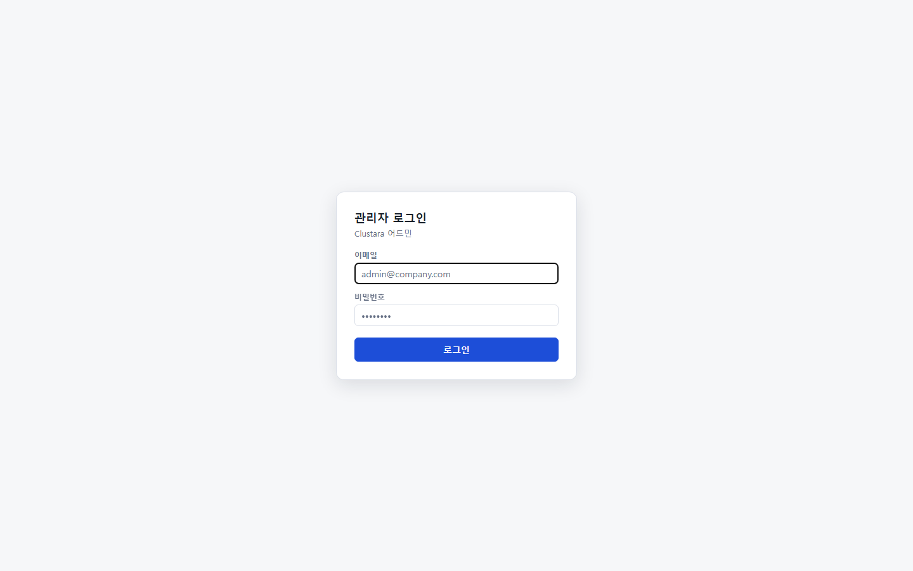

| 분류 | 명세 |
| --- | --- |
| **연동 API** | `POST /auth/login`, `POST /auth/refresh` |
| **관련 테이블** | `k8s_users` (또는 인메모리 부트스트랩 처리), `k8s_audit_events` |

---

## 1. 운영 홈 (Dashboard)
- **메뉴 경로**: `#/k8s-home`
- **개요**: 클러스터 전체의 건강 상태와 실시간으로 감지된 위험 요소를 한눈에 파악할 수 있는 종합 관제 대시보드입니다.
- **주요 기능**:
  - **위험 클러스터 TOP 5**: 경고 이벤트 및 장애 발생 빈도가 높은 클러스터 목록을 나열합니다.
  - **RCA 장애 후보 요약**: 현재 즉각 조치가 필요한 장애 후보군(CrashLoop, OOM 등)의 수를 표시합니다.
  - **최근 변경 이력**: 지난 24시간 동안 발생한 Kubernetes 리소스 리비전 변경 사항을 요약합니다.
  - **비용 TOP 5**: 리소스 사용량 기준 가장 비용이 많이 발생하는 네임스페이스 및 클러스터를 보여줍니다.

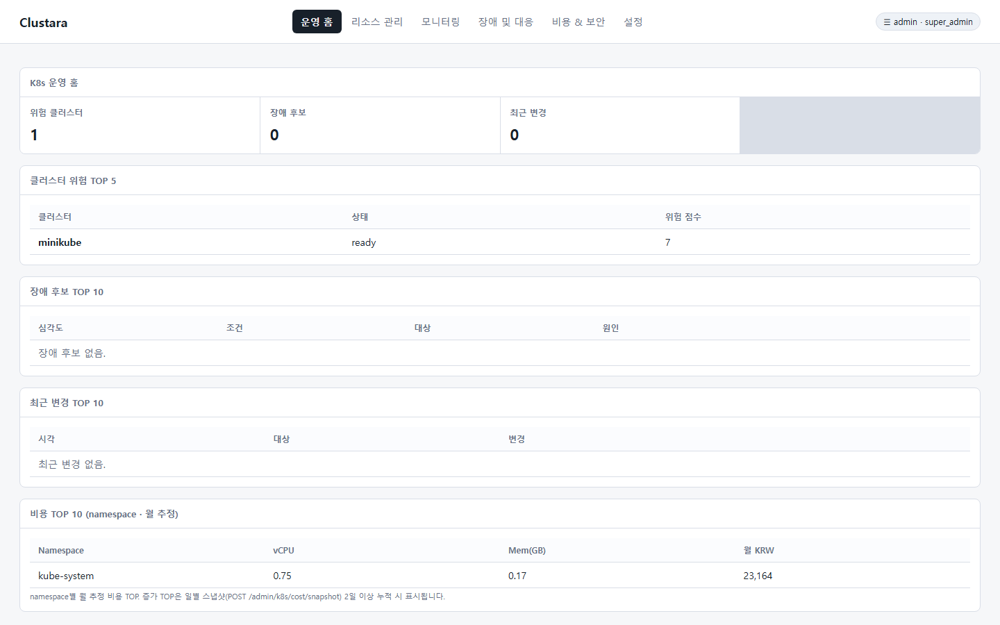

| 분류 | 명세 |
| --- | --- |
| **연동 API** | `GET /admin/k8s/inventory`, `GET /admin/k8s/findings` |
| **관련 테이블** | `k8s_clusters`, `k8s_inventory`, `k8s_events` |

---

## 2. 수집 상태 (Collector Status)
- **메뉴 경로**: `#/k8s-collector`
- **개요**: 인클러스터 에이전트(`clustara-agent`)의 실시간 하트비트와 데이터 수집 지연(Lag) 상태를 모니터링합니다.
- **주요 기능**:
  - **에이전트 하트비트**: 각 클러스터에 배포된 에이전트의 생존 여부 및 마지막 통신 시각을 추적합니다.
  - **Watch Lag 및 Offset**: API Server로부터의 실시간 리소스 변경 이벤트 수신 지연 시간을 메트릭으로 시각화합니다.
  - **체크포인트 상태**: 데이터 유실 방지를 위한 `resourceVersion` 저장 상태를 제공합니다.

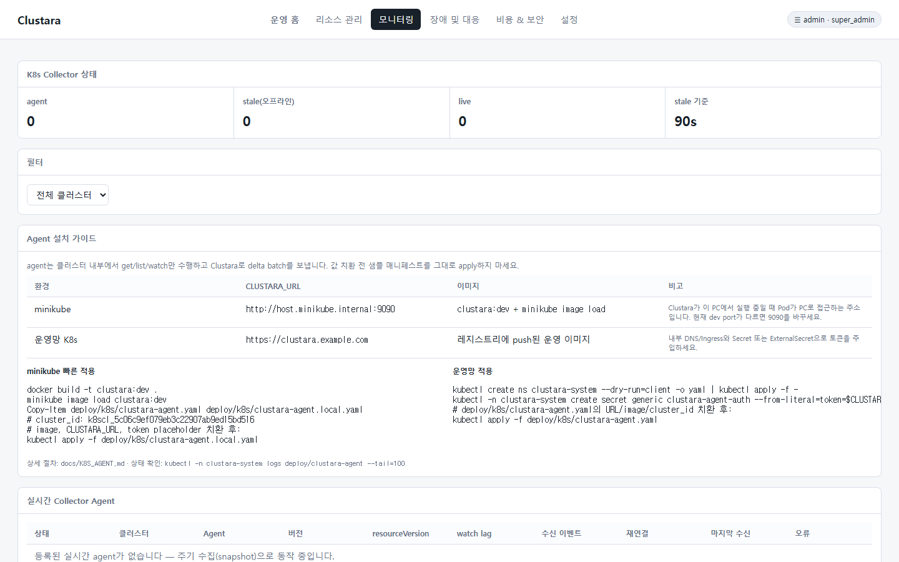

| 분류 | 명세 |
| --- | --- |
| **연동 API** | `GET /admin/k8s/agent/status` |
| **관련 테이블** | `k8s_agent_heartbeats`, `k8s_collector_offsets`, `k8s_collector_status` |

---

## 3. 리소스 인벤토리 (Inventory)
- **메뉴 경로**: `#/k8s`
- **개요**: 연결된 모든 Kubernetes 클러스터의 네임스페이스, 노드, 워크로드(Deployment, StatefulSet, DaemonSet, Pod)의 자산 목록을 논리적 구조로 통합 제공합니다.
- **주요 기능**:
  - **자원 필터링**: 클러스터 그룹 및 네임스페이스 기준으로 전체 리소스 수량을 동적 필터링합니다.
  - **QoS 및 상태 요약**: 각 워크로드의 CPU/메모리 Request 및 사용률 메트릭을 요약 제공합니다.

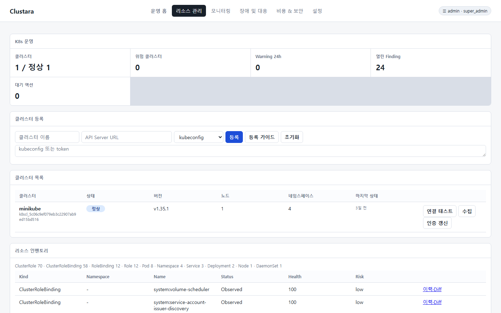

| 분류 | 명세 |
| --- | --- |
| **연동 API** | `GET /admin/k8s/inventory` |
| **관련 테이블** | `k8s_inventory` |

---

## 4. Pod 관리 및 분석 (Pod Management)
- **메뉴 경로**: `#/k8s-pods`
- **개요**: 특정 Pod의 상세 상태 분석, 실시간 로그 스트리밍, 자가 진단 및 디버깅 도구를 통합 제공하는 클러스터라의 핵심 메뉴입니다.
- **주요 기능**:
  - **지능형 로그 분석**: 에러 패턴(Exception, OOM 등)을 AI/규칙 기반으로 그룹핑하여 근거 라인과 조치법을 제시합니다.
  - **Golden Pod Diff**: 동일 Workload 내 가장 건강한 Pod를 자동으로 선별하여 장애 Pod의 스펙(env, image 등) 차이점을 대조 분석합니다.
  - **Health Replay**: 이벤트, 메트릭, 변경 리비전, 로그 조회 기록을 단일 시간축으로 정렬하여 장애 시점의 전후 흐름을 재생합니다.
  - **증적 번들 다운로드**: 문제 발생 Pod의 로그, 이벤트, Manifest, 메트릭을 하나의 ZIP 파일로 즉시 패키징하여 다운로드합니다.

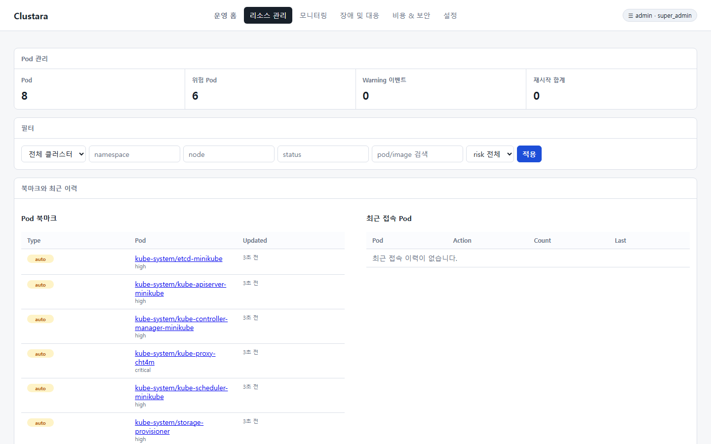

| 분류 | 명세 |
| --- | --- |
| **연동 API** | `GET /admin/k8s/pods`, `GET /admin/k8s/pods/{namespace}/{pod}`, `GET /admin/k8s/pods/{namespace}/{pod}/logs`, `POST /admin/k8s/pods/{namespace}/{pod}/logs/analyze`, `POST /admin/k8s/pods/{namespace}/{pod}/evidence-bundle`, `GET /admin/k8s/pods/{namespace}/{pod}/golden-diff`, `GET /admin/k8s/pods/{namespace}/{pod}/health-replay` |
| **관련 테이블** | `k8s_inventory`, `k8s_events`, `k8s_pod_log_queries`, `k8s_pod_log_snapshots` |

---

## 5. 변경 타임라인 (Timeline)
- **메뉴 경로**: `#/k8s-timeline`
- **개요**: 특정 리소스의 탄생부터 현재까지의 Manifest 변경(스펙 리비전) 및 K8s 이벤트를 결합하여 시간순 타임라인을 제공합니다.
- **주요 기능**:
  - **리소스 Diff 엔진**: 이전 버전과 현재 버전의 YAML 코드를 라인 단위로 대조하여 변경된 필드(replicas, image 등)를 하이라이트합니다. (암호 및 토큰 등 민감 정보는 자동 마스킹 처리됩니다.)

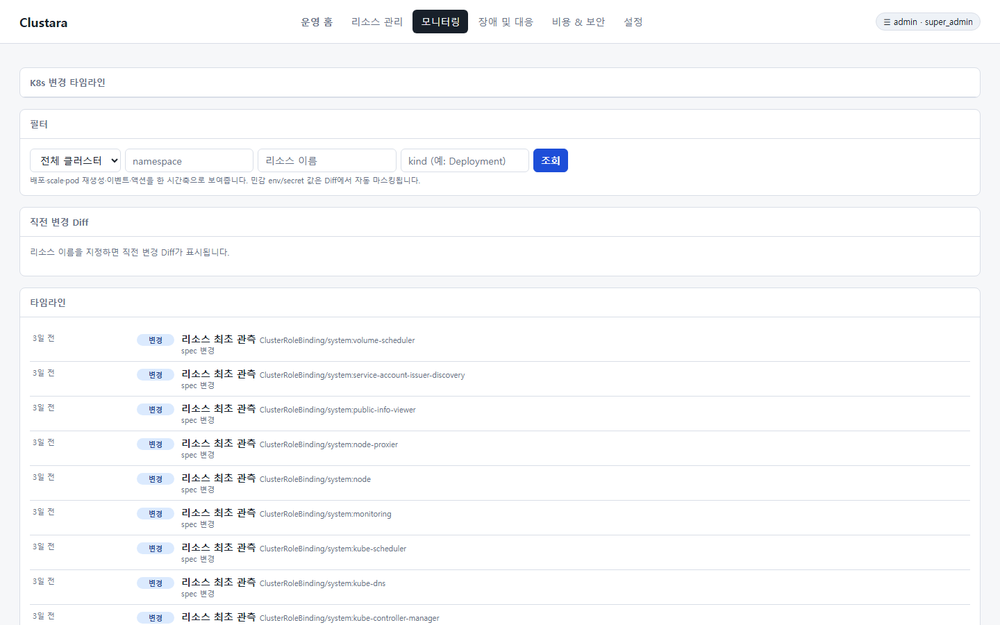

| 분류 | 명세 |
| --- | --- |
| **연동 API** | `GET /admin/k8s/revisions`, `GET /admin/k8s/diff`, `GET /admin/k8s/timeline` |
| **관련 테이블** | `k8s_resource_revisions`, `k8s_events` |

---

## 6. 장애 분석 (RCA)
- **메뉴 경로**: `#/k8s-rca`
- **개요**: 수집된 경고 이벤트와 변경 이력을 기반으로 장애의 근본 원인(RCA-01~RCA-10)을 자체 엔진으로 진단하여 원인 후보와 안전한 조치 방안을 추천합니다.
- **주요 기능**:
  - **장애 유형별 진단**: CrashLoop, OOMKilled, ImagePullBackOff, Pending(PVC 누락 등), NodePressure 상태를 즉각 식별합니다.
  - **조치 방안 제시**: 스케일 아웃, 롤아웃 재시작, 노드 Cordon 등 안전한 대응 조치 가이드를 함께 제공합니다.

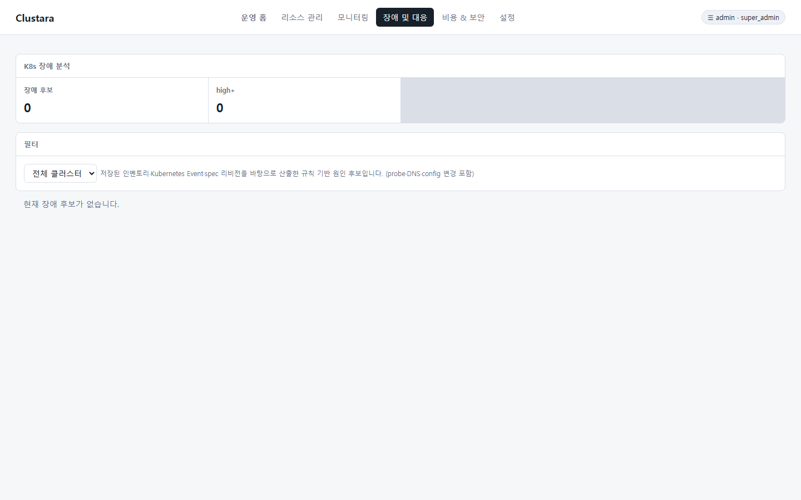

| 분류 | 명세 |
| --- | --- |
| **연동 API** | `GET /admin/k8s/rca` |
| **관련 테이블** | `k8s_inventory`, `k8s_events`, `k8s_resource_revisions` |

---

## 7. 장애 워룸 (Incidents)
- **메뉴 경로**: `#/k8s-incidents`
- **개요**: 감지된 High/Critical RCA 장애 후보를 지능적으로 그룹화하여 수명주기(Open/Resolved)를 관리하고 공동 대응을 지원하는 장애 워룸 워크스페이스입니다.
- **주요 기능**:
  - **인시던트 상세 관리**: 인시던트 연관 리소스 구조(리소스 그래프), 실시간 탐지 근거, 관련 이벤트 및 변경 타임라인을 통합 제공합니다.
  - **수동 종료 및 AI 요약**: 대응 완료 후 조치 사유를 입력하여 Resolved 상태로 전환하고 대응 이력을 보관합니다.

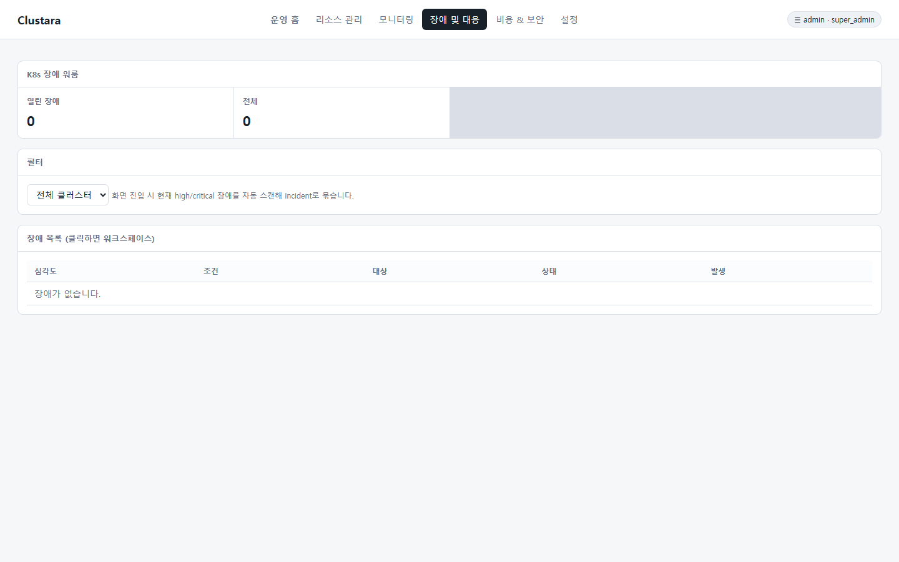

| 분류 | 명세 |
| --- | --- |
| **연동 API** | `GET/POST /admin/k8s/incidents`, `GET /admin/k8s/incidents/{id}`, `POST /admin/k8s/incidents/{id}/resolve` |
| **관련 테이블** | `k8s_incidents`, `k8s_incident_logs` |

---

## 8. 리소스 그래프 (Resource Graph)
- **메뉴 경로**: `#/k8s-graph`
- **개요**: Ingress ↔ Service ↔ Endpoint ↔ Workload(Pod) ↔ PVC ↔ ConfigMap/Secret 간의 토폴로지 관계를 분석하여 장애 전파 범위(Blast Radius)를 시각적인 그래프로 조립합니다.
- **주요 기능**:
  - **의존성 트랙킹**: 특정 노드나 Pod 장애 시, 이와 연결된 상위 서비스 및 수신 트래픽 경로 상의 영향 범위를 하이라이트합니다.
  - **오너십 연계**: 그래프 노드 선택 시 담당 팀 및 비용 센터 정보를 즉각 오버레이합니다.

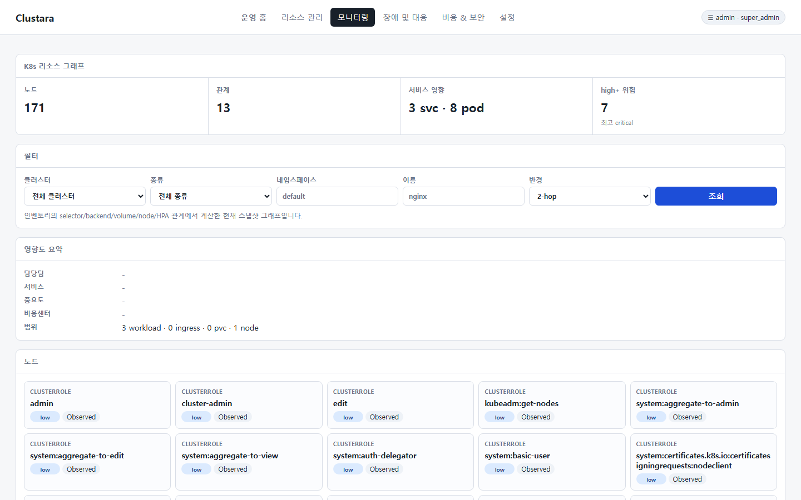

| 분류 | 명세 |
| --- | --- |
| **연동 API** | `GET /admin/k8s/resource-graph` |
| **관련 테이블** | `k8s_inventory` |

---

## 9. 연결성 점검 (Connectivity)
- **메뉴 경로**: `#/k8s-conn`
- **개요**: 네트워크 수신(Ingress)부터 백엔드 서비스(Service, Endpoint) 및 스토리지(PVC, PV) 매핑 상태를 주기적으로 검증하여 연결 고리가 끊어진 지점을 진단합니다.
- **주요 기능**:
  - **진단 항목**: Endpoint 미연결 Service, TLS 인증서가 누락된 Ingress, FailedMount 상태의 PVC 등을 자동 탐지합니다.

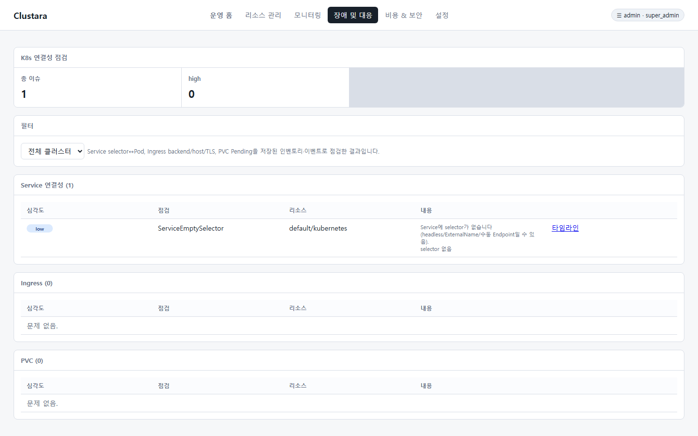

| 분류 | 명세 |
| --- | --- |
| **연동 API** | `GET /admin/k8s/connectivity` |
| **관련 테이블** | `k8s_inventory`, `k8s_events` |

---

## 10. 액션 승인함 (Actions)
- **메뉴 경로**: `#/k8s-actions`
- **개요**: 클러스터에 물리적인 변경을 가하는 위험 조치 작업(스케일, 재시작, 노드 제어 등)의 사전 영향도를 평가하고, 관리자 승인 단계를 거쳐 안전하게 실행하는 실클러스터 제어 엔진입니다.
- **주요 기능**:
  - **실행 가능 액션**: `scale`, `rollout_restart`, `cordon`, `uncordon`, `delete_pod`를 지원합니다.
  - **승인 워크플로우**: 승인 권한자가 영향도 요약을 검토 후 승인/반려 처리를 수행하며, 모든 실행 결과는 감사 로그에 상세히 기록됩니다.

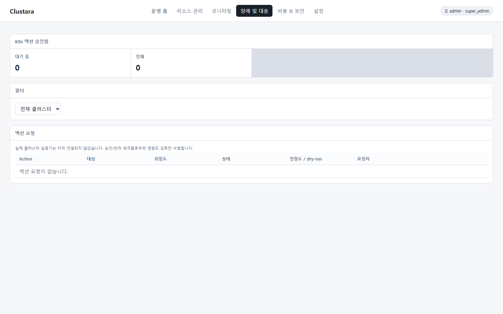

| 분류 | 명세 |
| --- | --- |
| **연동 API** | `GET/POST /admin/k8s/actions`, `POST /admin/k8s/actions/{id}/approve|reject|execute` |
| **관련 테이블** | `k8s_action_requests` |

---

## 11. 용량 및 자동확장 (Capacity)
- **메뉴 경로**: `#/k8s-capacity`
- **개요**: 클러스터 노드 자원의 요청률(Bin Packing)과 GPU 사용률, HPA 임계치 한계 도달 여부 등을 종합 분석하여 자원 고갈 위험 및 오토스케일링 정체 상태를 조기 진단합니다.
- **주요 기능**:
  - **노드 소진일 예측**: 메트릭 추세를 기반으로 자원 소진 예상일을 산출합니다.
  - **복제본 시뮬레이터**: 타겟 복제본 수(Replica) 변경 시 추가로 필요한 총 리소스 요구량을 미리 시뮬레이션합니다.

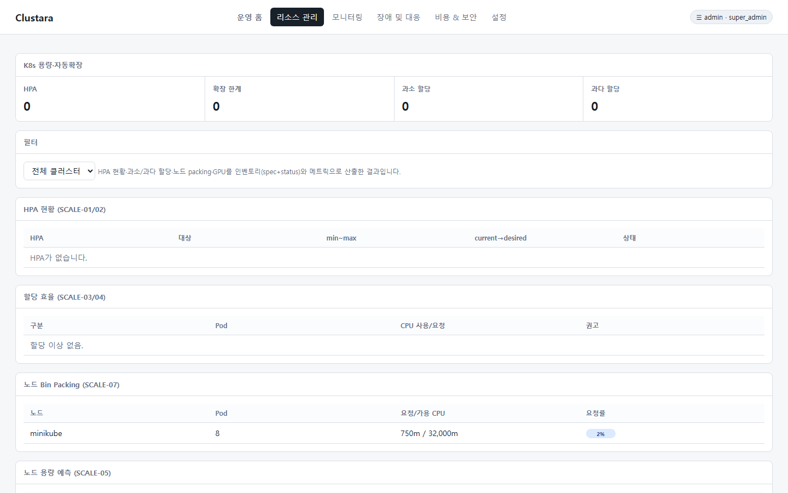

| 분류 | 명세 |
| --- | --- |
| **연동 API** | `GET /admin/k8s/capacity`, `POST /admin/k8s/capacity/simulate` |
| **관련 테이블** | `k8s_inventory`, `k8s_metrics` |

---

## 12. 그룹 및 오너십 (Metadata)
- **메뉴 경로**: `#/k8s-meta`
- **개요**: 물리적 클러스터들을 논리적인 업무망 단위(운영망, 개발망, DMZ 등)로 그룹핑하고 네임스페이스 단위의 담당 팀, 담당자, 중요도 및 비용 센터 정보를 구성하는 관리 도구입니다.
- **주요 기능**:
  - **그룹 및 메타데이터 관리**: 알림 라우팅 정책(Mattermost) 및 네임스페이스별 비용 집계의 기초 자료로 활용됩니다.

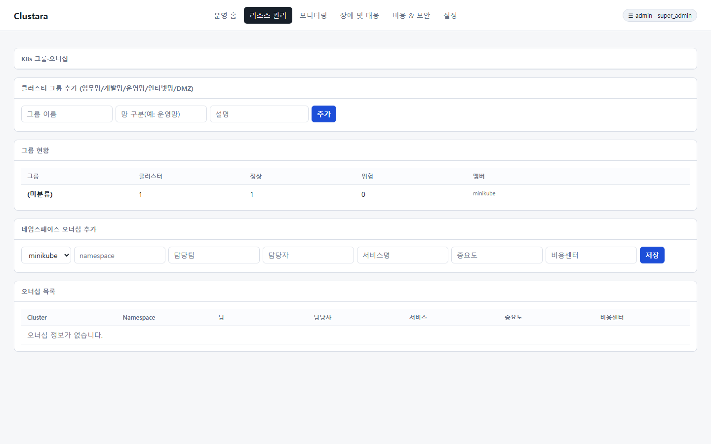

| 분류 | 명세 |
| --- | --- |
| **연동 API** | `GET/POST /admin/k8s/groups`, `GET/POST /admin/k8s/ownership` |
| **관련 테이블** | `k8s_cluster_groups`, `k8s_namespace_ownership` |

---

## 13. AI 운영 분석 (AI Assistant)
- **메뉴 경로**: `#/k8s-ai`
- **개요**: 수집된 실시간 RCA 분석 정보, Warning 이벤트, 그리고 소스 리비전 변경 Diff 정보만을 신뢰할 수 있는 소스(Grounding Source)로 삼아 자연어 형태의 장애 해결법 및 일일/주간 운영 종합 보고서를 작성해 주는 AI 비서 기능입니다.
- **주요 기능**:
  - **근거 기반 질의**: Grounding 데이터가 부족한 경우 환각(Hallucination) 방지를 위해 추측 답변을 거부하고 관련 수집 지표를 우선 반환합니다.

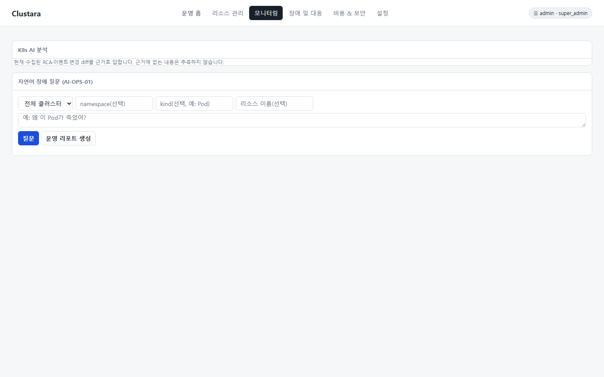

| 분류 | 명세 |
| --- | --- |
| **연동 API** | `POST /admin/k8s/ai/ask`, `POST /admin/k8s/ai/report` |
| **관련 테이블** | `k8s_inventory`, `k8s_events`, `k8s_incidents` |

---

## 14. 비용 센터 (Cost)
- **메뉴 경로**: `#/k8s-cost`
- **개요**: vCPU 및 메모리당 단가 설정을 기준으로 네임스페이스, 비용 센터, 클러스터 그룹별 월 추정 비용을 정산하고 비용 절감을 위한 Rightsizing 가이드를 제공합니다.
- **주요 기능**:
  - **FinOps Rightsizing**: Pod의 자원 할당량(Request) 대비 실제 사용량 메트릭을 추적하여 `usage x 1.3` 기준의 적정 자원 스펙 권장값을 산출하고, 다운사이징 시 예상되는 월간 절감액(KRW)을 표기합니다.

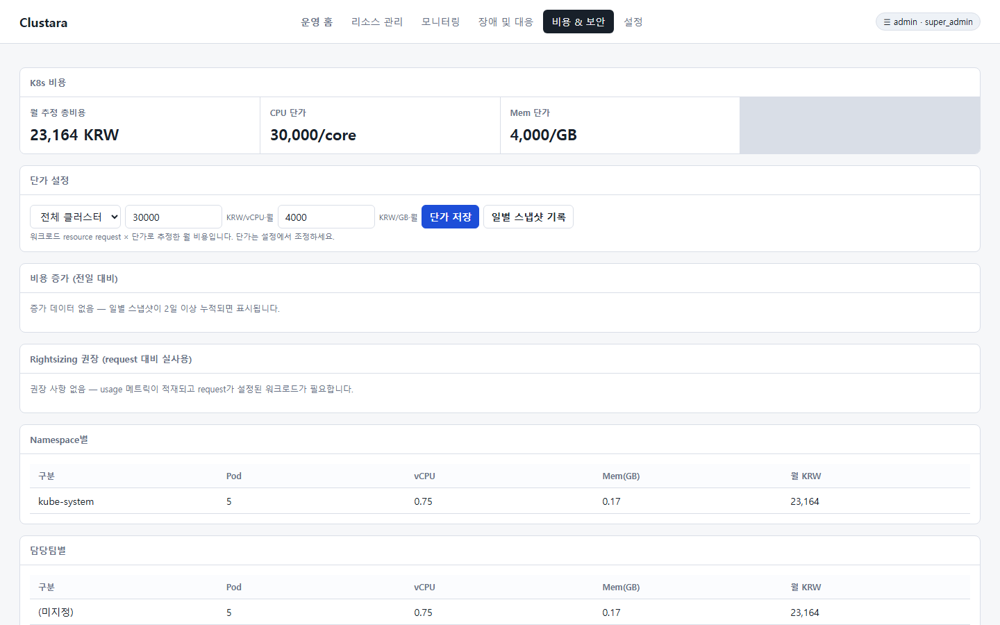

| 분류 | 명세 |
| --- | --- |
| **연동 API** | `GET /admin/k8s/cost`, `GET/POST /admin/k8s/cost/config`, `GET /admin/k8s/cost/recommendations` |
| **관련 테이블** | `k8s_inventory`, `k8s_metrics`, `k8s_cost_configs` |

---

## 15. 보안 센터 (Security)
- **메뉴 경로**: `#/k8s-security`
- **개요**: 이미지 태그 정책 위반, TLS 인증서 만료 임박, Secret 무단 참조, 과도한 권한의 RBAC 정책 등 클러스터의 전반적인 보안 위협을 실시간 스캔하여 보안 점수(Security Score)를 산출합니다.
- **주요 기능**:
  - **인증서 만료 스캔**: Secret 내 x509 인증서의 만료 예정일을 실시간 파싱하여 사전 경고를 제공합니다.
  - **RBAC 변경 추적**: 관리자 권한(`cluster-admin`)이 부여된 룰의 변경 내역을 대조 분석합니다.

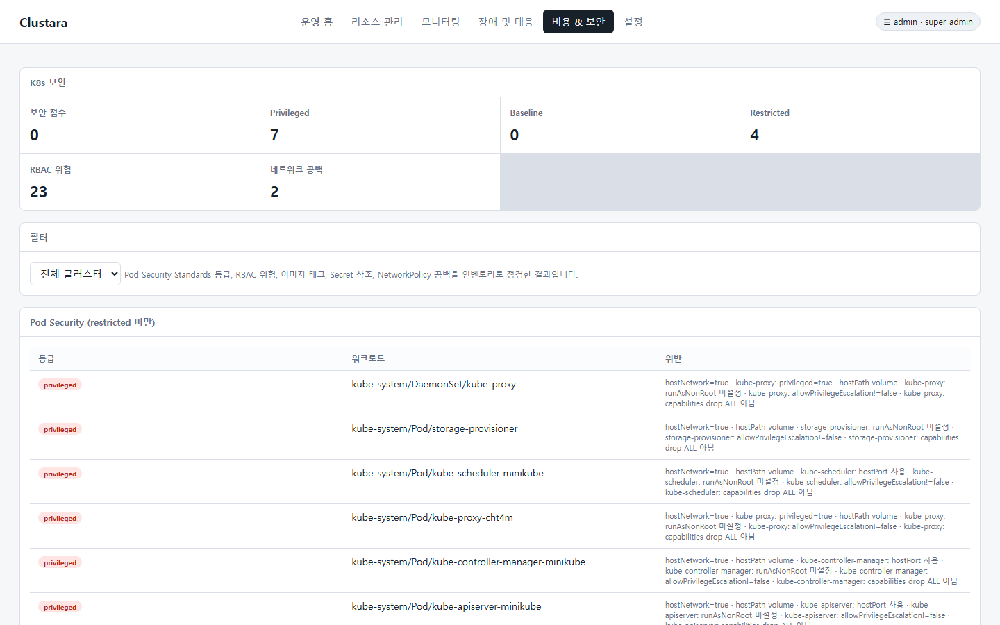

| 분류 | 명세 |
| --- | --- |
| **연동 API** | `GET /admin/k8s/security`, `GET /admin/k8s/rbac-diff` |
| **관련 테이블** | `k8s_security_findings`, `k8s_inventory` |

---

## 16. 정책 센터 (Policy)
- **메뉴 경로**: `#/k8s-policy`
- **개요**: Admission Controller의 안전장치를 시뮬레이션하고, 클러스터의 정책 컴플라이언스 기준(Pod Security Standards) 부합 여부를 사전 진단하는 정책 거버넌스 도구입니다.
- **주요 기능**:
  - **Admission 시뮬레이터**: 적용 예정인 YAML Manifest를 올려 사전에 수립된 보안 정책(privileged 금지, hostPath 제한 등)에 통과하는지 미리 시뮬레이션(Allow/Deny)합니다.

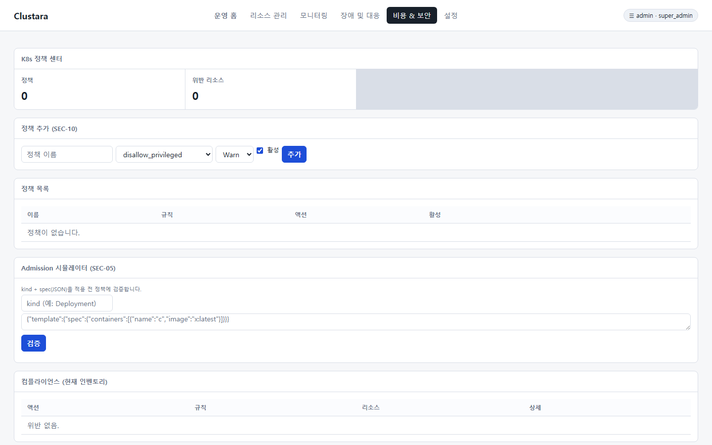

| 분류 | 명세 |
| --- | --- |
| **연동 API** | `GET/POST /admin/k8s/policies`, `POST /admin/k8s/policies/simulate`, `GET /admin/k8s/policies/compliance` |
| **관련 테이블** | `k8s_terminal_policies` |

---

## 17. SLO 센터 (SLO)
- **메뉴 경로**: `#/k8s-slo`
- **개요**: 네임스페이스 및 서비스 단위로 설정한 가용성 목표값(기본 99.9%) 대비 현재의 에러 버짓 잔여율과 가용 시간, 그리고 복구 시간(MTTR)을 실시간 산출하여 신뢰성을 관리합니다.
- **주요 기능**:
  - **에러 버짓 트랙킹**: 발생한 인시던트의 지속 시간(Downtime Proxy)을 집계하여 소진된 가용성 예산을 정밀 계산합니다.

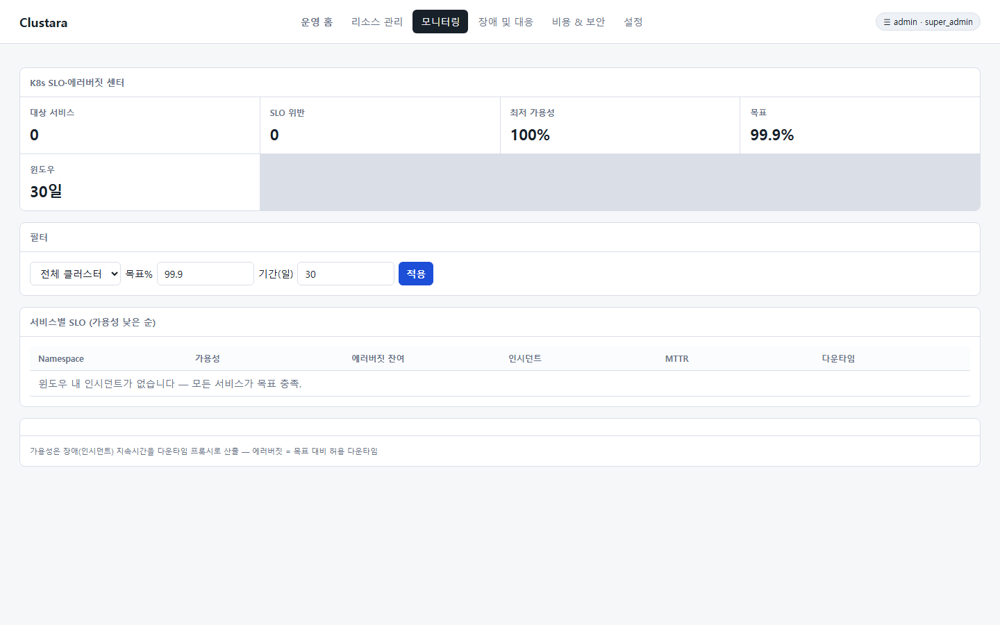

| 분류 | 명세 |
| --- | --- |
| **연동 API** | `GET /admin/k8s/slo` |
| **관련 테이블** | `k8s_incidents` |

---

## 18. 운영 설정 (Settings)
- **메뉴 경로**: `#/k8s-settings`
- **개요**: 단가 기준, 알림 정책(조용한 시간, 팀별 채널 매핑), 그리고 안전한 터미널 접속을 통제하는 Terminal Policy Builder 설정을 한 곳에서 관리하는 메뉴입니다.
- **주요 기능**:
  - **Terminal Policy Builder**: 실제 Pod에 접속하여 명령을 내리기 전, 접속 역할(Role), 대상 네임스페이스, 금지 명령어 패턴(rm, dd, mkfs, kubectl delete 등 기본 차단), 세션 최대 제한 시간, 관리자 승인 여부를 사전에 정의하고 강제하는 게이트웨이 역할을 수행합니다.

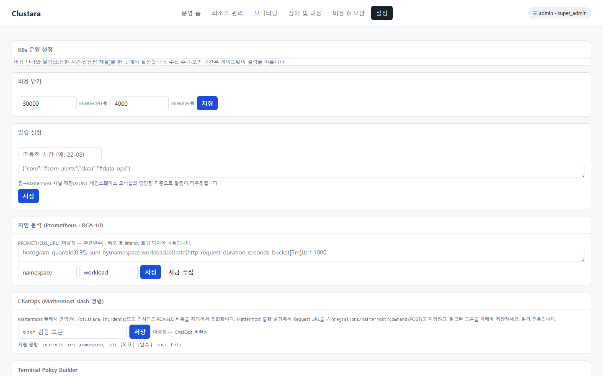

| 분류 | 명세 |
| --- | --- |
| **연동 API** | `GET/POST /admin/k8s/terminal-policies`, `POST /admin/k8s/terminal-policies/evaluate` |
| **관련 테이블** | `k8s_terminal_policies`, `k8s_pod_exec_sessions` |
