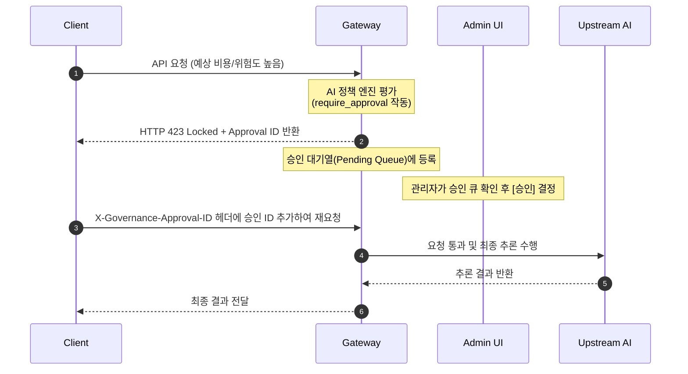

# Clustara - 안전 및 보안 거버넌스 운영 가이드 (Safety & Governance Operations Guide)

> **참고 — Clustara K8s 운영 허브.** 이 문서는 **내장 게이트웨이 코어**의 AI 트래픽 안전·거버넌스(정책 엔진·Secret Firewall·승인 워크플로우)를 다룹니다. **Kubernetes 보안·정책**(Pod Security 등급·RBAC 위험/Diff·이미지/Secret/NetworkPolicy·TLS 만료·Admission 시뮬레이터·정책 팩)은 어드민 UI의 **보안 / 정책 센터** 메뉴와 **[K8s 운영 허브 가이드](K8S_OPERATIONS_HUB.md)** 를 참고하세요.

본 가이드는 Clustara 어드민 대시보드의 **안전(Safety)** 탭에서 제공하는 핵심 보안 통제 기능들의 아키텍처, 작동 매커니즘, 상세 설정 규격 및 API 활용법을 설명합니다. 본 시스템은 전사 AI 트래픽의 안전성을 확보하고 비즈니스/재무 리스크를 선제적으로 통제하기 위한 다차원 보안 기능을 탑재하고 있습니다.

---

## 목차
1. [긴급 정지 (Kill Switch)](#1-긴급-정지-kill-switch)
2. [비용 가드 및 예측 (Cost Guard & Predictor)](#2-비용-가드-및-예측-cost-guard--predictor)
3. [AI 정책 엔진 (AI Policy Engine)](#3-ai-정책-엔진-ai-policy-engine)
4. [민감 정보 방화벽 (Secret Firewall)](#4-민감-정보-방화벽-secret-firewall)
5. [승인 워크플로우 (Approval Workflow)](#5-승인-워크플로우-approval-workflow)
6. [AI 장애 감지 (AI Incident Monitor)](#6-ai-장애-감지-ai-incident-monitor)
7. [지능형 실시간 알림 규칙 (Alert Rules)](#7-지능형-실시간-알림-규칙-alert-rules)

---

## 1. 긴급 정지 (Kill Switch)

중대한 보안 침해 사고(예: 전사적 프롬프트 인젝션 공격, 대규모 민감 데이터 유출 등)나 인프라 위급 상황이 발생했을 때, **1초 이내에 Clustara를 통과하는 모든 AI 호출 트래픽을 즉시 차단**하는 비상 장치입니다.

### 1.1 작동 메커니즘
- **즉각 차단**: 스위치가 활성화되면 모든 `/v1/...` 경로에 대한 API 호출이 백엔드 업스트림으로 전달되지 않고 즉시 차단됩니다.
- **반환 규격**:
  - **HTTP Status Code**: `503 Service Unavailable`
  - **Response Header**: `Retry-After: 60`, `X-Kill-Switch: global`
  - **Response Body**: 차단 사유(Reason)를 담은 에러 메시지 반환
- **추적성 보장**: 스위치 상태 변경 시 변경자(ID), 변경 사유(Reason), 변경 시각이 감사 로그(`audit_events`) 및 시스템 DB에 기록됩니다.

### 1.2 API 활용 예제
```bash
# 1. 킬스위치 즉시 작동 (전체 차단)
curl -X POST http://localhost:9090/admin/kill-switch \
  -H "Authorization: Bearer $ADMIN_TOKEN" \
  -H "Content-Type: application/json" \
  -d '{"disabled": true, "reason": "긴급 내부 보안 점검으로 인한 임시 서비스 차단"}'

# 2. 서비스 운영 재개 (정상화)
curl -X POST http://localhost:9090/admin/kill-switch \
  -H "Authorization: Bearer $ADMIN_TOKEN" \
  -H "Content-Type: application/json" \
  -d '{"disabled": false}'
```

---

## 2. 비용 가드 및 예측 (Cost Guard & Predictor)

통제 불가능한 대규모 API 호출로 인한 **재무적 손실(Cost Spike)을 방지**하기 위한 가드레일 장치입니다.

### 2.1 예산 한도 통제 (Cost Guard)
- **임계값 제어**: 안전 탭에서 지정한 임계값(KRW 단위)을 초과하는 요청이 발생할 경우 트랜잭션을 사전 차단합니다.
- **차단 규격**:
  - **HTTP Status Code**: `402 Payment Required`
  - **헤더 우회 지원**: 긴급한 작업의 경우, 클라이언트가 HTTP 헤더에 `X-Cost-Approve: 1`을 실어 보내면 통제 규칙을 일시 우회하여 통과를 허용합니다. (해당 우회 이력은 별도 감사 로그로 집계됨)
- **실시간 통계 제공**: 모든 중계 응답의 HTTP 헤더에 실시간 비용 메트릭을 동적으로 주입합니다:
  - `X-Estimated-Input-Tokens` / `X-Estimated-Output-Tokens`
  - `X-Estimated-Cost-KRW` / `X-Estimated-Latency-MS`

### 2.2 비용 예측 엔진 (Cost Predictor)
- **동적 예측 원리**: 입력 토큰 수와 `max_tokens` 설정을 기반으로 응답 요금을 사전에 연산합니다. 출력 토큰 예측 시, 지정된 모델의 **최근 7일간 평균 출력 토큰량**을 기본 통계 표본으로 적용하여 단순 단가 곱셈보다 정교한 청구 요금을 예측합니다. (데이터 부족 시 기본 600토큰으로 수렴)
- **UI 연동**: 안전 탭 하단의 "비용 예측" 계산기를 통해 모델명, 입력 토큰 수, max_tokens를 입력하여 실시간 가상 요금 및 지연 시간을 즉시 계산해볼 수 있습니다.

---

## 3. AI 정책 엔진 (AI Policy Engine)

사내 규정 준수 및 보안 등급 관리를 위한 **동적 룰 평가 엔진(Governance Rule Engine)**입니다. 

### 3.1 룰 평가 우선순위
- 정책 리스트의 **우선순위(Priority, 1~999)** 값을 기준으로 정렬되어 순차적으로 평가됩니다. **우선순위 숫자가 낮을수록** 먼저 검사됩니다.
- 여러 정책이 동시에 매칭되면 최종 동작은 `BLOCK > APPROVAL > ALLOW > DEFAULT` 순서로 결정됩니다. 예를 들어 한 rule이 `require_approval` 을 만들고 다른 rule이 `block` 을 만들면 HTTP 403 차단이 승인을 이깁니다.
- 매칭된 판단은 `policy_decision_events` 에 남습니다. 차단/승인뿐 아니라 허용 판단(`allow`, `allow_model`, `allow_provider`)도 감사 추적을 위해 기록됩니다.
- 매칭 규칙이 없는 정상 허용 경로도 `decision=default` 로 기록됩니다. XView·Trace Links·요청 상세의 실질 거버넌스 카운트(`policy_decision_count`)는 `default`를 제외하고, 원시 감사 이벤트 수는 `policy_decision_total` 로 확인합니다.

### 3.2 9대 정책 조건 (Conditions)
정책 규칙 생성 시 매핑할 수 있는 조건 항목 명세입니다:

| 조건명 (Condition) | 조건값 예시 | 설명 |
| :--- | :--- | :--- |
| `contains_secret` | `true` / `false` | 민감 정보(Secret) 발견 여부 |
| `risk_score` | `>80`, `>=50` | AI Risk Analyzer가 분석한 위험도 점수 |
| `complexity_score` | `>85`, `>=60` | 프롬프트 및 코드 밀도 기반 0~100 복잡도 점수 |
| `cost_krw` | `>1000` | 요청 1건당 예상 환산 비용(원) |
| `team` | `platform` | 호출 사용자의 소속 팀 ID 또는 팀명 매핑 |
| `role` | `developer`, `viewer` | 사용자의 권한 등급 |
| `model` | `gpt-*`, `claude-3-5*` | 클라이언트가 호출한 LLM 모델 (와일드카드 패턴 지원) |
| `provider` | `openai`, `anthropic` | 최종 라우팅될 타겟 업스트림 프로바이더 |
| `mcp_tool` | `execute_bash` | 호출에 사용된 MCP 도구명 |

### 3.3 8대 제어 조치 (Actions)
조건 충족 시 실행할 액션 지정 명세입니다:

- **`block`**: 요청을 즉시 반려하고 에러 반환.
- **`require_approval`**: 런타임에 트래픽을 일시 유보하고 **승인 큐(Approval Queue)**로 전달.
- **`secret_mask`**: 민감한 시크릿 정보가 포함되었을 경우, 해당 부분만 `[MASKED_...`로 마스킹 후 업스트림 전달.
- **`secret_block`**: 민감 정보 포함 시 즉시 트랜잭션 전면 차단.
- **`deny_models`**: 특정 모델 리스트에 대한 호출 권한을 박탈 (액션값에 모델명 명시).
- **`allow_models`**: 허용된 모델 리스트 외의 모든 모델 호출 차단.
- **`deny_providers`** / **`allow_providers`**: 특정 업스트림 공급자 대상 라우팅 통제.
- **`allow`**: 명시적 허용 판단을 감사 로그에 남김. 단, 같은 요청에서 `block` 이 매칭되면 차단이 우선합니다.

### 3.4 정책 예제

```yaml
- name: block-secret-leak
  contains_secret: true
  block: true

- name: approve-high-risk
  risk_score: ">80"
  require_approval: true

- name: security-team-model-allowlist
  team: security
  allow_models:
    - gpt-5
    - claude-sonnet
```

동시에 매칭되는 경우 `block-secret-leak` 가 최종 동작을 결정합니다. `approve-high-risk` 와 `security-team-model-allowlist` 의 판단도 감사 이벤트에 남아 사후 설명과 증빙에 사용할 수 있습니다.

---

## 4. 민감 정보 방화벽 (Secret Firewall)

사내 소스코드 및 대화 트래픽 내에 **API Key, 패스워드, 인증 토큰 등이 포함되어 외부 LLM에 유출되는 것을 실시간 스캔하고 제어**하는 지능형 보안 장치입니다.

### 4.1 탐지 대상 시크릿 유형
- 사내/외 API Keys (Github Token, OpenAI Key, Slack Webhook 등)
- DB 접속 커넥션 스트링 (JDBC, PostgreSQL DSN 등)
- 비대칭 키 및 SSH Private Keys
- JWT (JSON Web Tokens) 및 OAuth Access Tokens
- 텍스트 내 포함된 패스워드 및 크레덴셜 정보

### 4.2 스캔 제어 액션
1. **Detect (탐지)**: 트래픽은 그대로 통과시키되, 탐지 내역을 감사 로그(`secret_events`)에 상세 기록하여 보안 관제 모니터링을 지원합니다.
2. **Mask (마스킹)**: 보안이 침해된 데이터 영역을 감지하여 `[MASKED_API_KEY]` 등의 가공 문자열로 치환하여 모델에 전송합니다. 개발 도구(Cursor 등)의 연속적인 작업을 방해하지 않으면서 자산을 보호합니다.
3. **Block (차단)**: 민감 정보 감지 시 즉시 전송을 무효화하고 HTTP `403 Forbidden` 에러를 반환합니다.

---

## 5. 승인 워크플로우 (Approval Workflow)

비용이 크거나 위험도가 높은 에이전트 작업을 수행하기 전, **보안 관리자의 승인을 거쳐 트래픽을 통과시키는 휴먼-인-더-루프(Human-in-the-Loop) 시스템**입니다.



### 5.1 운영 방법
- **대기열 조회**: 관리자는 안전 탭의 **승인 큐**에서 상태가 `pending`인 승인 건의 상세 내용(사용자, 사유, 위험도, 요금 등)을 확인합니다.
- **결정**: 관리자가 심사 후 `Approve`(승인) 또는 `Reject`(거절)을 결정하면, 대기 중이던 클라이언트 재요청이 인증 단계를 무사히 통과하게 됩니다.

---

## 6. AI 장애 감지 (AI Incident Monitor)

다중 업스트림 환경에서 특정 AI 공급자(OpenAI, Anthropic 등)의 **네트워크 장애, 5xx 서브시스템 다운 타임을 실시간 추적하고 시각화**하는 모니터링 모듈입니다.

- **장애 판정 기준**: 프로바이더별 **자동 전환(Fallback) 또는 5xx 오류**가 **시간당 5건 이상** 발생할 경우 시스템은 이를 인시던트로 규정하고 대시보드에 적재합니다.
- **영향 범위 가시성**: 해당 장애로 인해 우회 경로로 대피한 횟수(폴백 횟수) 및 이로 인해 작업 중단 위기를 모면한 **실제 사용자 수(명)**를 집계하여 정량적인 인프라 복원력을 입증합니다.

---

## 7. 지능형 실시간 알림 규칙 (Alert Rules)

이상 트래픽, 비용 폭주, 에이전트 오동작(무한 루프) 등을 실시간 감시하여 **슬랙(Slack) 등의 Webhook으로 관리자에게 긴급 푸시하는 경보 규칙 엔진**입니다.

### 7.1 핵심 알림 지표 (14종)
안전 탭의 알림 규칙 생성기에서 제공하는 핵심 감시 지표 규격입니다:

- **`requests`**: 지정된 시간 내 총 API 요청 수 급증 감시.
- **`errors`**: 5xx 에러 및 라우팅 오류 발생률 (0.00 ~ 1.00 범위).
- **`krw`**: 시간 윈도우 내 발생한 누적 원화 비용 급증 감시.
- **`tokens`**: 소모 토큰 수 급등 감시.
- **`latency_p95_ms`** / **`first_chunk_p95_ms`**: 인프라 병목 탐지용 전체/첫 번째 토큰 지연 시간 P95 지표.
- **`llm_eval_failures`** / **`llm_eval_failure_rate`**: 답변 품질 자동 검증 실패 건수 및 실패율 감시.
- **`tool_errors`** / **`tool_error_rate`**: 에이전트가 실행한 도구(Tool) 호출 실패 수 및 실패율.
- **`tool_loop`**: **에이전트 도구 루프 감지 지표.** 하나의 작업 세션 내에서 특정 도구가 반복 호출된 최대 횟수를 측정하여 무한 루프로 인한 요금 낭비를 사전 방지.
- **`mcp_new_tools`**: **MCP 신규 도구 감지 (드리프트).** 시스템에 등록되지 않았던 새로운 MCP 툴이 유입되는 횟수를 감지하여 권한 통제.
- **`anomaly_zmax`**: 비용/트래픽 빈도 통계 분석 기반 이상 징후 Z-Score 최댓값 감시.
- **`budget_burn_ratio`**: **예산 소진 가속도 감시.** 현재 요금 소모 속도 기준, 월말에 도달했을 때 *월말 누적 예상액 / 배정된 월 예산* 비율을 계산하여 한도 도달 전 미리 통보 (`1.0` 초과 시 월말 예산 초과를 의미).
