# Data Works 사용자 가이드

> 적용 버전: **v0.9.51**<br>
> 서비스 화면: `http://<host>:8080/dataworks/`<br>
> 설치·인증·AI 공급자 설정은 [관리자 가이드](ADMIN_GUIDE.md)를 참고하세요.

## 1. 이 제품이 하는 일

Data Works는 창고에 쌓여 있는 데이터를 **고객에게 팔 수 있는 데이터 상품**으로 만들고 운영하는 작업 공간입니다. 자산을 등록하면 준비도를 점수로 계산하고, 상품 기획(블루프린트)·위험 검토·데이터 오너·법무·준법 승인·증적 묶음(Evidence Pack)·계약·출시·수익 분석까지 한 흐름 안에서 이어 줍니다.

이 제품이 대신해 주는 일은 **출시해도 되는지 판단하는 근거를 모으고 지키는 일**입니다. 승인 메일과 검토 문서를 사람이 모아 확인하는 대신, 상품마다 어떤 조건이 충족되고 무엇이 빠졌는지를 화면과 API가 같은 규칙으로 판정합니다. 조건을 채우지 못한 상품은 화면의 `상품 출시` 버튼도, 출시 API도 똑같이 막습니다.

쓰는 사람은 셋입니다. **데이터 상품 기획·운영 담당자**는 자산과 상품을 등록하고 출시까지 끌고 갑니다. **법무·준법·데이터 오너**는 검토 센터와 상품 작업 공간의 `승인` 탭에서 결정을 남깁니다. **API를 실제로 쓰는 개발자**는 내 API 키를 발급받아 OpenAI 호환 API, MCP, 상품 런타임 API를 호출합니다. 화면과 버튼은 한국어로 제공되며 데스크톱과 모바일 브라우저를 지원합니다.

> 이 문서의 모든 화면은 v0.9.51을 실제로 띄워 가상 데이터로 촬영했습니다. 실제 사용자, 고객, 계약 또는 키 정보가 아닙니다.

## 2. 처음 5분 — 로그인해서 오늘 처리할 일 하나 끝내기

한 번에 따라 할 수 있는 길입니다. 로그인부터 "출시를 막고 있던 상품이 무엇 때문에 막혔는지 확인하고 승인을 남기는" 데까지 갑니다.

### 1단계 — 로그인한다

브라우저에서 `http://<host>:8080/dataworks/`를 엽니다. 운영자가 발급한 이메일과 비밀번호를 입력하거나, `Keycloak SSO로 계속` 버튼이 보이면 조직 계정으로 로그인합니다. 로그인 화면 아래에 현재 **서비스 버전**이 표시되므로 문의할 때 이 값을 함께 전달하면 됩니다.


### 2단계 — 관제실에서 오늘 처리할 일을 고른다

로그인하면 `팩토리 관제실`이 열립니다. `확인이 필요한 작업` 줄에서 **출시 차단** 카드의 숫자를 봅니다. 이 숫자가 오늘 출시를 막고 있는 상품 수입니다.

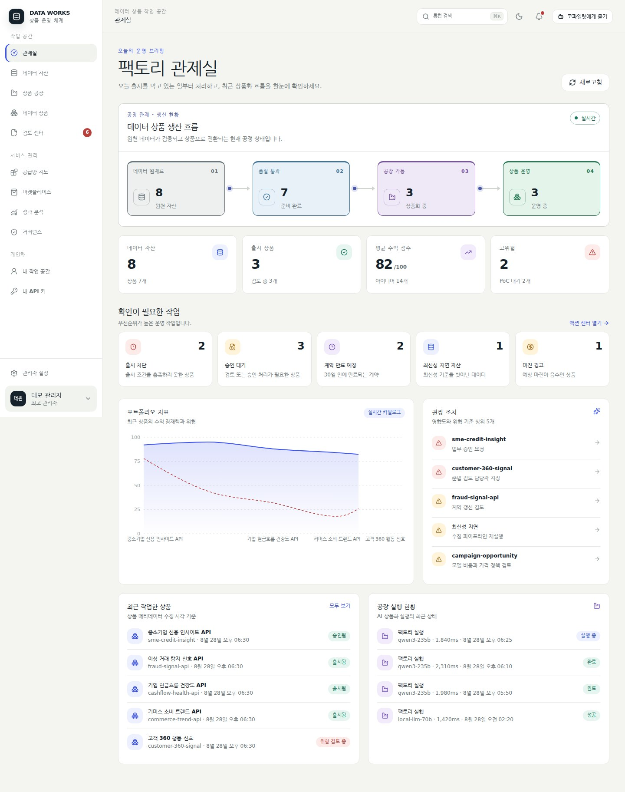

### 3단계 — 검토 센터에서 대상 상품을 연다

카드를 누르면 그 유형으로 필터가 걸린 `검토 센터`가 열립니다. 액션 유형과 심각도로 다시 좁힌 뒤, 처리할 항목의 상품으로 이동합니다.

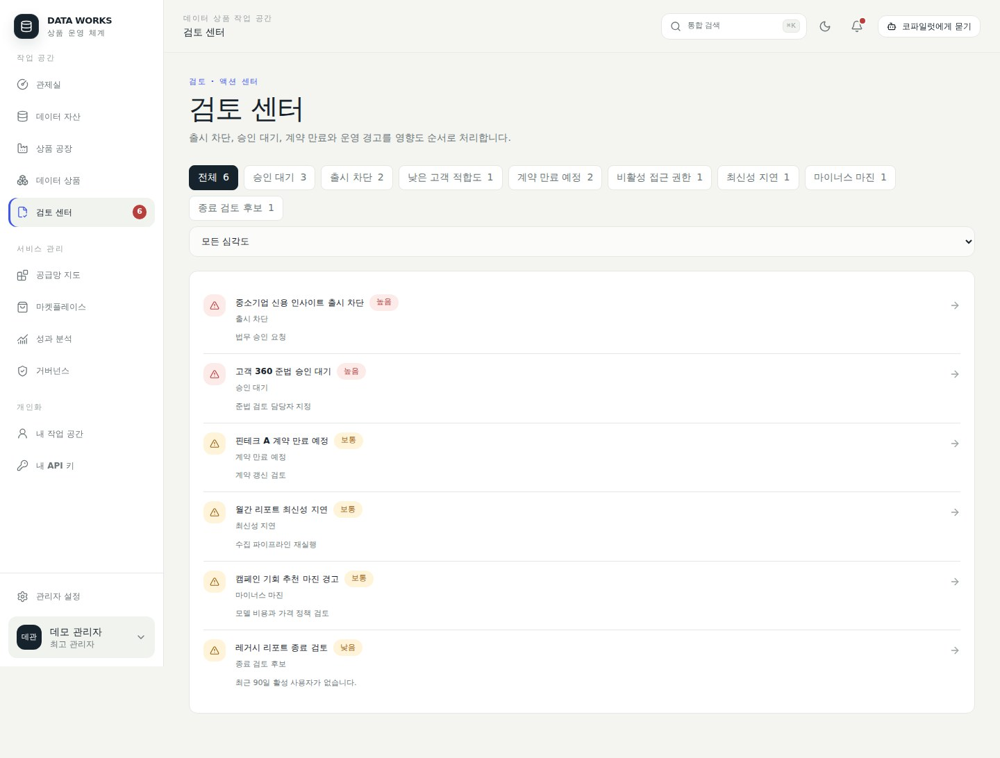

### 4단계 — 무엇 때문에 막혔는지 확인한다

상품 작업 공간의 `개요` 탭에 **출시 게이트**가 있습니다. 통과한 조건과 차단 사유가 함께 나오므로, 준비도가 모자란 것인지 승인이 빠진 것인지 여기서 갈립니다.


### 5단계 — 승인 탭에서 결정을 남긴다

승인이 빠져 막힌 것이라면 `승인` 탭으로 이동합니다. `데이터 오너 승인`·`법무 승인`·`준법 승인` 각각의 상태와 만료일이 보입니다. 담당자는 `결정 기록`으로 결과와 증적을 남기고, 새 검토 항목이 필요하면 `승인 항목 추가`를 씁니다.

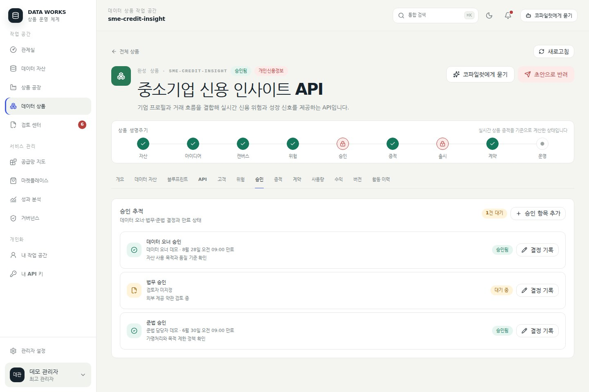

빠진 승인을 채우고 `개요` 탭으로 돌아오면 출시 게이트가 다시 계산됩니다. 모든 조건이 통과하고 상품이 아직 출시되지 않았다면 `상품 출시` 버튼이 나타납니다.

## 3. 화면 구성

### 접속 주소 구분

| 주소 | 용도와 동작 |
| --- | --- |
| `/dataworks/` | 새 React 기반 Data Works 화면의 **표준 진입점**입니다. |
| `/dataworks` | `/dataworks/`로 자동 이동합니다. |
| `/admin` | 기존(레거시) 관리자 콘솔입니다. 새 Data Works 화면의 진입점이 아닙니다. |
| `/` | 현재 서비스 UI 진입점이 아니며, 기본 구성에서는 `404 Not Found`를 반환합니다. |

따라서 일반 사용자와 관리자는 `http://<host>:8080/dataworks/`로 접속합니다. 조직의 대표 주소 `/`에서도 Data Works를 열어야 한다면 운영자가 리버스 프록시에서 `/`를 `/dataworks/`로 리다이렉트해야 합니다.

### 주요 메뉴

| 메뉴 | 주소 | 용도 |
| --- | --- | --- |
| 관제실 | `/dataworks/` | 생산 흐름, 주의 작업, 포트폴리오와 최근 실행 |
| 데이터 자산 | `/dataworks/assets` | 자산, 담당자, 민감도와 준비도 검색·조회 |
| 상품 공장 | `/dataworks/factory` | AI 상품화 실행과 정책 판정 조회 |
| 데이터 상품 | `/dataworks/products` | 상품 목록과 Product Workspace 진입 |
| 검토 센터 | `/dataworks/review` | 출시 차단, 승인 대기, 만료·운영 경고 분류 |
| 공급망 지도 | `/dataworks/portfolio` | 자산→상품→API→고객 관계 탐색 |
| 마켓플레이스 | `/dataworks/marketplace` | 출시된 상품 탐색 |
| 성과 분석 | `/dataworks/analytics` | 생명주기, 수익과 위험 분포 |
| 거버넌스 | `/dataworks/governance` | 승인, 계약, 권한과 출시 통제 |
| 내 작업 공간 | `/dataworks/personal` | 개인 사용량, 비용, 품질과 보안 신호 |
| 내 API 키 | `/dataworks/personal/keys` | 개인 키 발급, 변경, 회전과 폐기 |

브라우저를 새로고침해도 현재 주소를 기준으로 같은 메뉴가 다시 열립니다.

### 공통 도구

- `Ctrl+K` 또는 `Cmd+K`: 명령 팔레트와 통합 검색. 상품, 자산, 고객, 계약을 한 입력란에서 찾습니다.
- 알림 버튼: 승인 대기, 출시 차단과 운영 신호를 알림 센터에 모아 보여줍니다.
- `코파일럿에게 묻기`: 현재 상품 또는 운영 상황을 AI에 질문합니다.
- 테마 버튼: 밝은 화면과 어두운 화면을 전환합니다.
- 프로필 메뉴: 내 작업 공간, 내 API 키, 관리자 설정(권한이 있는 경우), OpenAPI와 Swagger 문서로 이동하고 **서비스 버전**을 확인합니다.

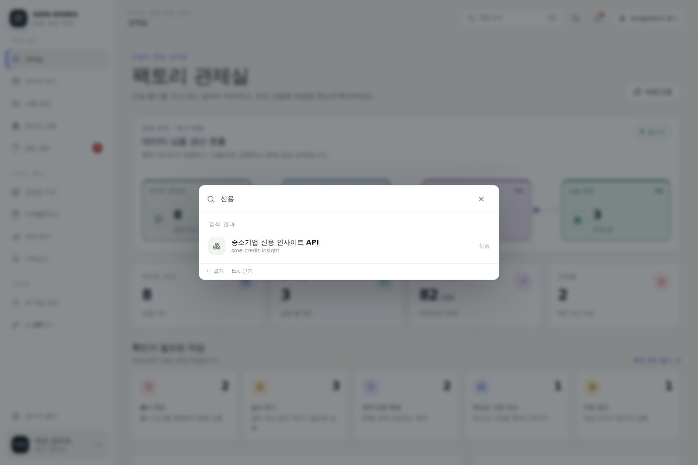

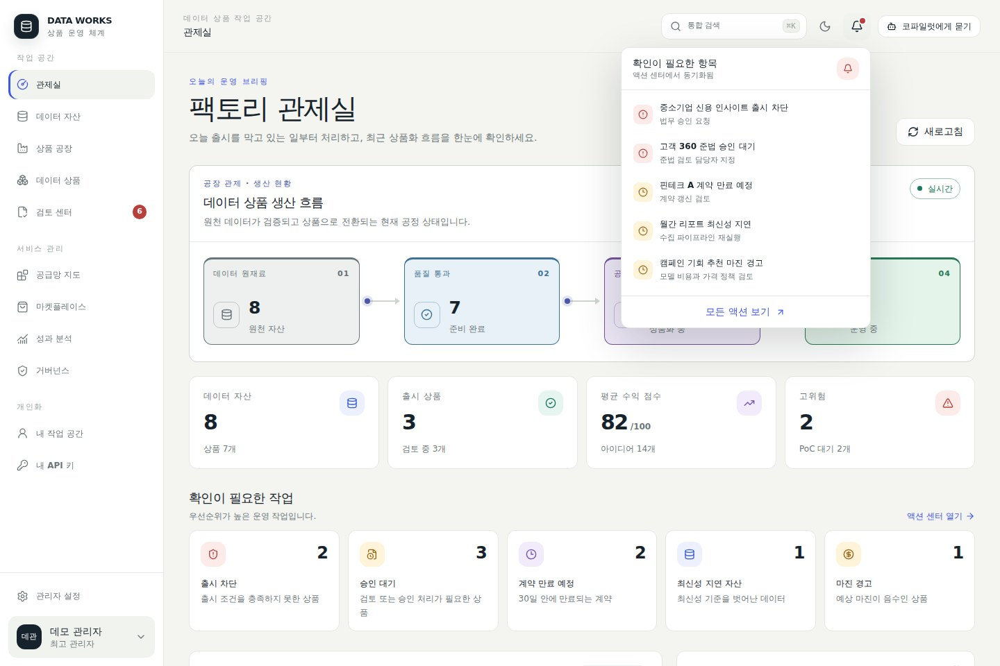


모바일에서는 상단 `메뉴 열기` 버튼으로 같은 탐색 메뉴를 엽니다.

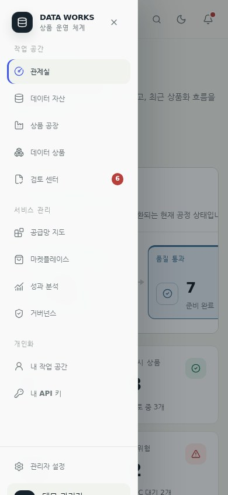

## 4. 관제실

관제실은 처리할 일을 먼저 보여주는 작업 공간입니다.

1. `RAW → READY → BUILD → LIVE` 생산 흐름을 확인합니다.
2. 출시 차단, 승인 대기, 계약 만료, 마진 경고와 오래된 자산을 확인합니다.
3. 카드를 선택해 필터가 적용된 검토 센터로 이동합니다.
4. 권장 조치에서 영향도가 높은 상품을 엽니다.
5. 최근 상품과 상품 공장 실행 상태를 확인합니다.

## 5. 데이터 자산과 준비도

`데이터 자산`에서는 자산 이름·키·도메인·담당자로 검색하고 도메인과 민감도로 필터링합니다. 준비도는 스키마, 최신성, 샘플, 결측, 민감도, 외부 제공 가능성, API와 과금 준비 등을 100점 기준으로 나타냅니다.

민감하거나 고위험인 상품의 원천 자산은 준비도 `70` 미만이면 출시가 차단될 수 있습니다.

쓰기 권한이 있는 사용자는 React 화면에서 자산을 등록·수정하고, 개별 또는 전체 준비도를 재평가하며, 확인 대화상자를 거쳐 자산을 삭제할 수 있습니다. 상품이 원천 자산으로 참조 중인 항목은 관계 무결성을 위해 삭제가 차단됩니다.

```http
POST /admin/dataworks/assets/{asset_key}/readiness/check
GET  /admin/dataworks/assets/readiness?asset_key={asset_key}
DELETE /admin/dataworks/assets?asset_key={asset_key}
```

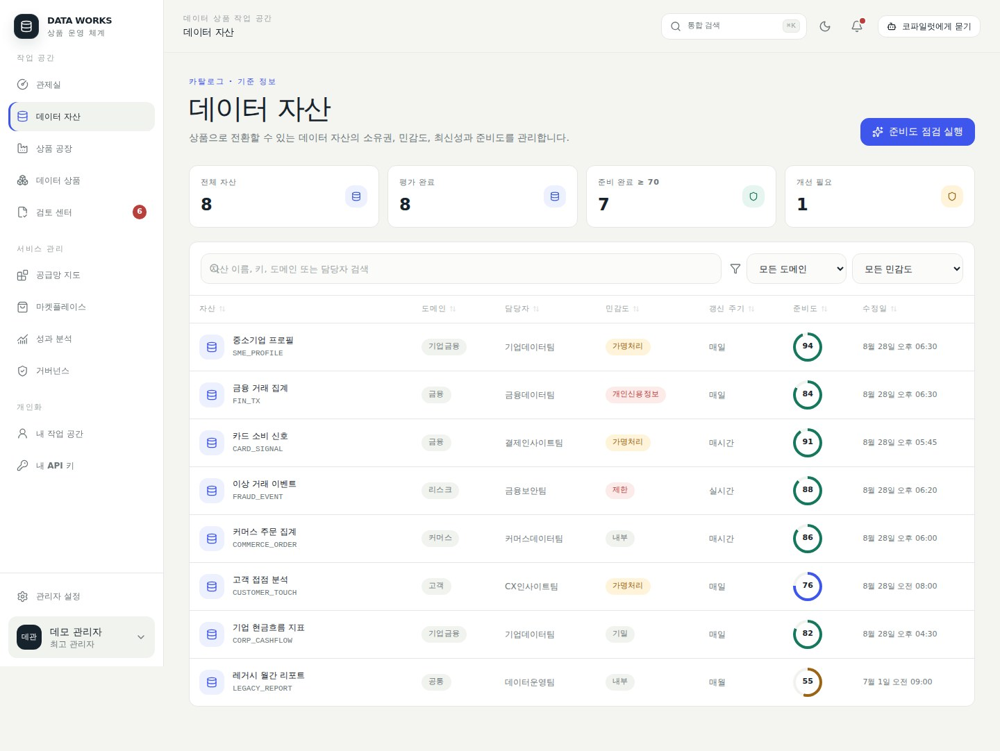

## 6. 상품 공장

상품 공장은 데이터가 `입력 노드 → AI 정제 스테이션 → 정책 출시 게이트 → 상품 패키지`로 처리된 실행 이력을 보여줍니다.

- 최근 30일 실행 수와 완료 수
- 평균 응답 시간과 토큰 비용
- 모델과 프롬프트 버전
- 정책 허용·차단 판정
- 실행 상태와 생성 시각

현재 React 화면은 **실행 관찰 화면**입니다. 새 아이디어·정의서 생성, 실행 재생과 평가는 관리 API 또는 기존 관리자 콘솔에서 수행합니다.

```http
POST /admin/dataworks/factory/ideas
POST /admin/dataworks/factory/definitions
POST /admin/dataworks/factory/runs/{id}/replay
POST /admin/dataworks/factory/runs/{id}/evaluate
```

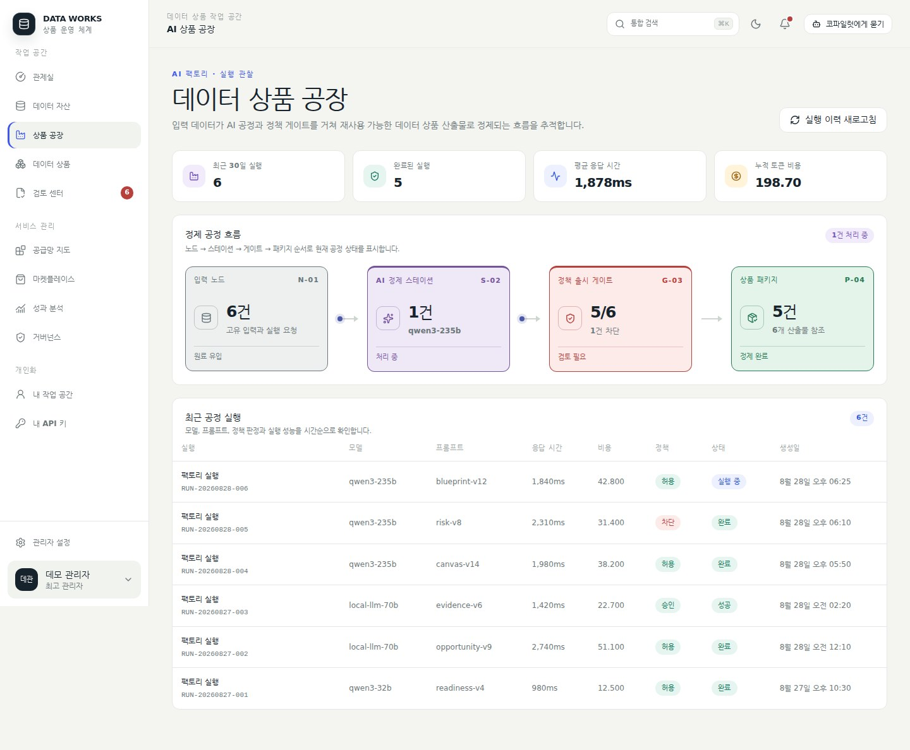

## 7. 데이터 상품과 Product Workspace

`데이터 상품`에서 상품을 선택하면 상품 작업 공간이 열립니다. 상단 생명주기 단계는 자산, 아이디어, 설계, 위험, 승인, 증적, 출시, 계약과 운영 상태를 실제 저장 증적에서 계산합니다.

쓰기 권한이 있으면 상품 목록에서 상품을 생성·수정하고 `draft` 또는 `archived` 상태만 삭제할 수 있습니다. 삭제한 상품의 감사·실행 이력은 보존되며, 과거 승인·계약이 새 상품에 섞이지 않도록 해당 상품 키는 영구 폐기됩니다. 상품 작업 공간에서는 상태 전환, Product Canvas 저장, 승인 추적 항목 추가·갱신과 계약 버전 생성을 수행합니다. 계약은 감사 가능성을 위해 새 버전을 누적하는 append-only 방식이며, 기존 버전이나 과거 이력을 수정·삭제하지 않습니다.

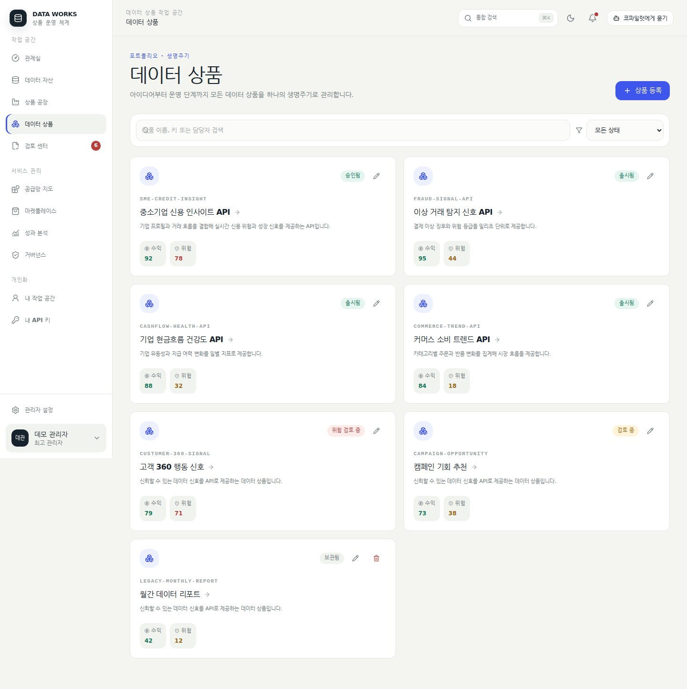

현재 실제 데이터를 제공하는 탭:

| 탭 | 보여주는 것 |
| --- | --- |
| 개요 | 출시 게이트, 상품 점수와 완성도 |
| 데이터 자산 | 원천 자산과 준비도 |
| 블루프린트 | 고객 문제, 구매자, 사용 사례, 가격과 PoC 성공 기준 |
| 위험 | 위험 점수, 위험 검토와 마스킹 상태 |
| 승인 | 데이터 오너·법무·준법 승인과 만료 상태 |
| 증적 | Evidence Pack 메타데이터와 JSON |
| 계약 | 최신 계약 버전 |

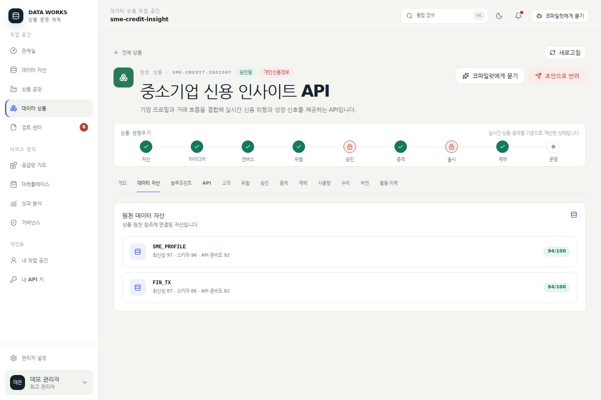

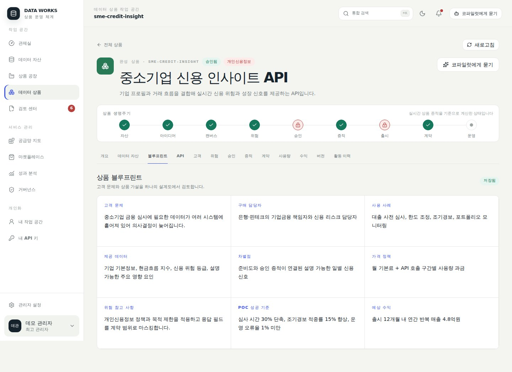

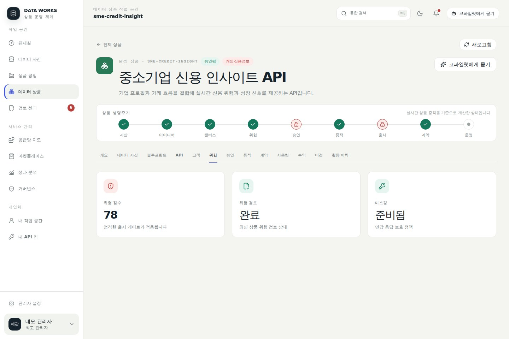

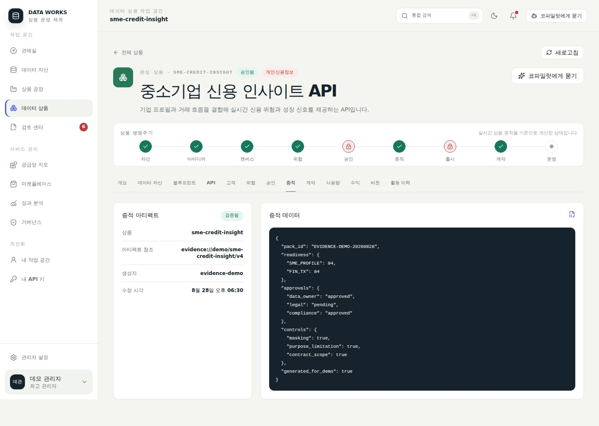

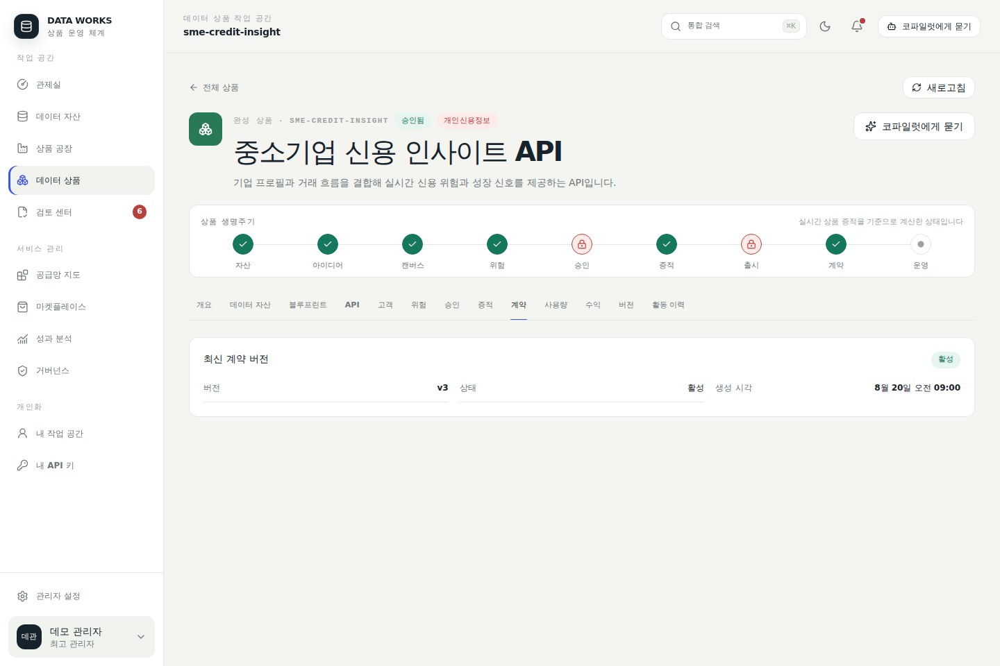

`API`, `고객`, `사용량`, `수익`, `버전`, `활동 이력`은 현재 향후 모듈 안내 화면입니다. 관련 백엔드 API가 존재하더라도 이 React 탭에서 편집하거나 실행할 수 있다고 해석하지 마세요.

## 8. 출시 게이트 읽기

상품 개요의 출시 게이트는 조건별 통과, 경고와 차단 사유를 보여줍니다. 민감하거나 `risk_score >= 70`인 상품의 주요 조건은 다음과 같습니다.

- 연결 자산 준비도 `70` 이상
- 데이터 오너 승인
- 법무 승인
- 준법 승인
- Evidence Pack 존재
- 승인 증적이 만료되지 않음

게이트가 허용 상태이고 상품이 아직 출시되지 않았다면 `상품 출시` 버튼이 표시됩니다. 차단 상태에서는 먼저 표시된 이유를 해결해야 합니다. 출시 API도 같은 게이트를 적용하며 차단 시 `409 Conflict`를 반환합니다.

```http
GET  /admin/dataworks/products/{product_key}/publish-gate
POST /admin/dataworks/products/{product_key}/publish
```

## 9. 검토 센터와 거버넌스

검토 센터에서는 액션 유형과 심각도를 필터링하고 대상 상품으로 이동합니다. 검토 센터 자체는 분류·이동 화면이며, 승인 추적 항목의 추가·결정 갱신은 연결된 상품 작업 공간의 `승인` 탭에서 수행합니다. 상품 상태를 즉시 승인·반려하는 검토 API는 운영 절차에 따라 별도로 사용할 수 있습니다.

```http
GET  /admin/dataworks/reviews
POST /admin/dataworks/reviews/{product_key}/approve
POST /admin/dataworks/reviews/{product_key}/reject
GET  /admin/dataworks/products/{product_key}/approvals
POST /admin/dataworks/products/{product_key}/approvals
```

거버넌스 화면은 승인 대기, 만료 임박 계약, 비활성 사용 권한과 출시 차단 수를 요약합니다.

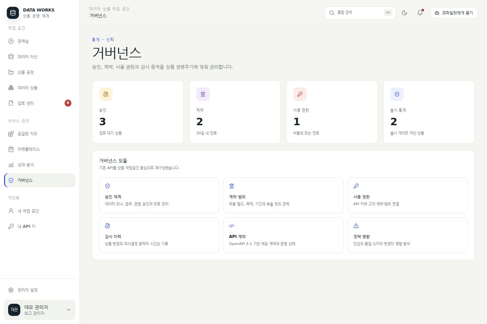

## 10. 공급망 지도, 마켓플레이스와 분석

### 공급망 지도

자산, 상품, API 제공 채널과 고객 성과의 관계를 확대·축소하며 탐색합니다. 노드의 링크로 연결 자산 또는 상품을 엽니다.

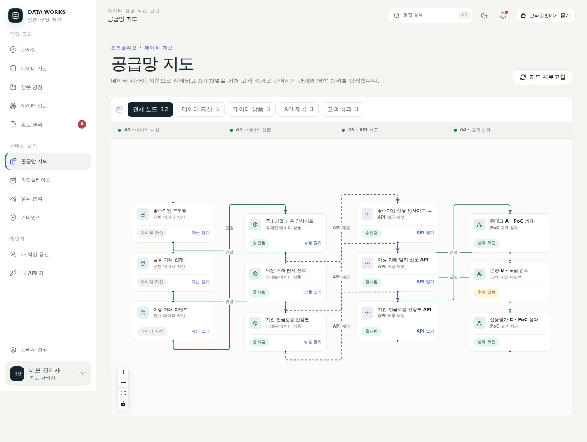

### 마켓플레이스

출시 상태가 `published`인 상품만 표시합니다. 현재 React 화면은 상품 탐색과 작업 공간 이동을 제공하며 접근 신청이나 PoC 요청 제출 기능은 아직 연결되지 않았습니다.

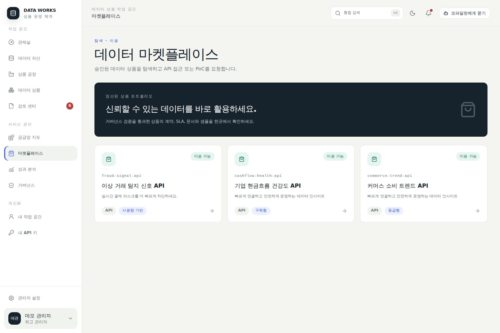

### 성과 분석

상품의 생명주기 분포와 상위 상품의 수익·위험 점수를 확인합니다.

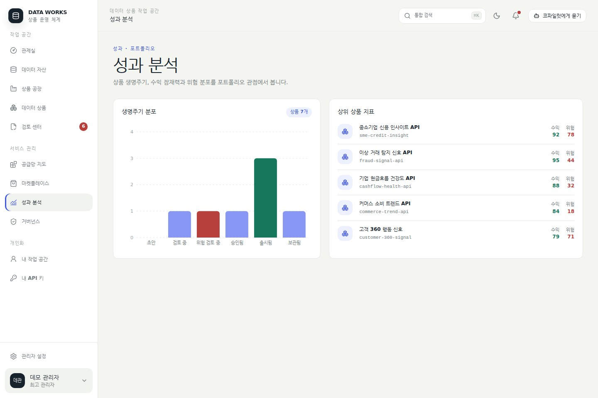

## 11. Data Works 코파일럿

상단 또는 상품 화면의 `코파일럿에게 묻기`를 선택합니다.

1. 연결된 모델 이름을 확인합니다.
2. 최대 토큰을 `1`~`262144` 범위에서 설정합니다.
3. 출시 차단 이유, 준비도 또는 다음 조치를 질문합니다.
4. 응답은 SSE 스트리밍으로 도착하며 `중지` 버튼으로 취소할 수 있습니다.

코파일럿은 현재 상품 키를 대화에 포함하지만 서버의 모든 상품 데이터를 자동 조회하는 도구형 에이전트는 아닙니다. 답변은 실제 출시 게이트와 증적 화면에서 확인하세요.

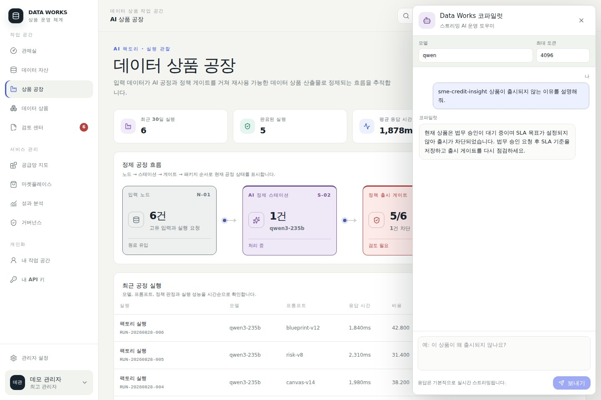

## 12. 내 작업 공간

개인화 화면은 서비스 관리자 화면과 분리되어 있습니다.

- 오늘 요청과 오류
- 이번 달 요청, 토큰과 비용
- 성공률과 위험 점수
- 평균 응답 시간, 캐시와 MCP 활용률
- 개인 키 경고와 최근 실패

개인화 지표는 원문 프롬프트가 아니라 사용 메타데이터에서 계산됩니다.

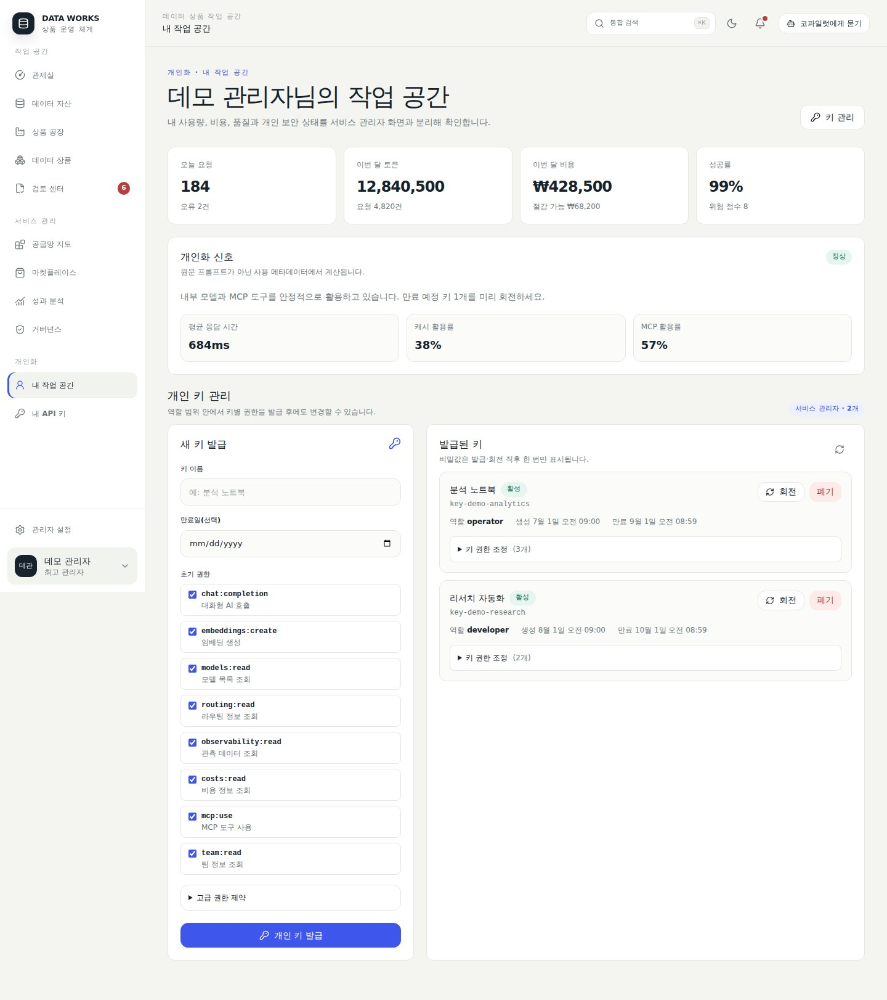

## 13. 개인 API 키 관리

개인 키는 역할이 허용한 범위 안에서 직접 발급할 수 있습니다.

### 발급

1. `내 API 키`로 이동합니다.
2. 키 이름과 선택적인 만료일을 입력합니다.
3. 역할에서 발급 가능한 초기 Scope를 선택합니다.
4. 필요하면 고급 권한 제약을 설정합니다.
5. `개인 키 발급`을 누릅니다.
6. 한 번만 표시되는 비밀값을 즉시 비밀 저장소에 복사합니다.

### 발급 후 변경 가능한 8개 정책

| 정책 | 의미 |
| --- | --- |
| `scopes` | 대화, 모델 조회, MCP 등 허용 기능 |
| `allowed_ips` | 허용 IP 또는 CIDR |
| `allowed_models` | 허용 모델 이름·패턴 |
| `denied_models` | 차단 모델 이름·패턴 |
| `allowed_providers` | 허용 AI 공급자 |
| `denied_providers` | 차단 AI 공급자 |
| `budget_limit_krw` | 원화 예산 한도, `0`은 무제한 |
| `expires_at` | 키 만료 시각 |

발급된 키의 `키 권한 조정`을 열고 변경 후 `권한 정책 저장`을 누릅니다. 최종 정책 전체가 현재 사용자의 권한과 상위 정책 범위 안에 있어야 하므로 사용자 권한보다 넓게 확대할 수 없습니다.

### 회전과 폐기

- `회전`: 새 비밀값과 ID를 만들고 기존 키를 폐기합니다. 8개 정책은 보존됩니다.
- `폐기`: 키를 즉시 비활성화합니다.
- 비밀값은 발급 또는 회전 직후에만 표시됩니다.


## 14. OpenAI 호환 API

개인 API 키를 `Authorization: Bearer` 헤더에 사용합니다. 기본 키 접두사는 `vc_sk_`입니다.

```bash
curl http://<host>:8080/v1/models \
  -H 'Authorization: Bearer vc_sk_...'
```

`/v1/chat/completions`에서 `stream`을 생략하면 서비스 기본값 `true`가 적용됩니다. 호출자가 `stream:false`를 명시하면 비스트리밍 응답을 유지합니다.

```bash
curl -N http://<host>:8080/v1/chat/completions \
  -H 'Authorization: Bearer vc_sk_...' \
  -H 'Content-Type: application/json' \
  -d '{
    "model": "qwen",
    "max_tokens": 4096,
    "messages": [{"role":"user","content":"출시 체크리스트를 작성해 줘"}]
  }'
```

서비스 출력 토큰 절대 상한은 `262144`입니다. 관리자가 더 낮은 상한을 설정했거나 연결 모델의 한도가 더 낮으면 그 제한이 우선합니다.

## 15. MCP 사용

| 주소 | 용도 |
| --- | --- |
| `/mcp` | 관리자가 등록한 외부 MCP 서버의 도구·프롬프트·리소스 집약 |
| `/mcp/gateway` | Data Works 자체 기능의 MCP 도구 제공 |

```json
{
  "mcpServers": {
    "dataworks": {
      "url": "http://<host>:8080/mcp/gateway",
      "headers": {"Authorization": "Bearer vc_sk_..."}
    }
  }
}
```

연결 템플릿과 진단:

```http
GET  /me/onboarding-pack?client=mcp|cursor|roo|cline|openai-sdk
POST /me/connection-doctor
```

키에는 `mcp:use` Scope가 있어야 하며 모델, 공급자, IP, 예산과 MCP 도구 정책이 함께 적용됩니다.

## 16. OpenAPI와 상품 API

- 전체 서비스 OpenAPI: `/openapi.json`
- Swagger UI: `/swagger`
- 상품별 OpenAPI: `/admin/dataworks/products/{product_key}/openapi`
- 출시 상품 런타임: `POST /v1/data-products/{product_key}/query`

상품 런타임 API는 출시 상태, Entitlement, Contract Scope와 만료를 검사합니다. 일반 개인 AI 키가 특정 상품 계약에 자동 Entitlement되는 것은 아닙니다. 필요한 경우 상품 운영자에게 계약 Scope와 Entitlement 연결을 요청하세요.

## 17. 자주 하는 작업

### 새 데이터 자산을 등록하고 상품에 쓸 수 있게 만들기

1. `데이터 자산` → 자산을 등록합니다(키, 이름, 도메인, 담당자, 컬럼 요약, 민감도, 갱신 주기).
2. 준비도 재평가를 실행합니다. 민감·고위험 상품에 쓰려면 `70` 이상이어야 합니다.
3. 점수가 낮으면 낮은 항목(최신성·샘플·결측 등)을 먼저 채우고 다시 평가합니다.
4. 상품 작업 공간의 `데이터 자산` 탭에서 이 자산이 원천으로 연결되었는지 확인합니다.

### 출시가 막힌 상품 풀어 주기

1. 상품 `개요` 탭에서 출시 게이트의 차단 사유를 읽습니다.
2. 준비도 부족이면 원천 자산으로 가서 위 절차를 밟습니다.
3. 승인 누락·만료면 `승인` 탭에서 해당 단계의 결정을 기록합니다.
4. 증적이 없으면 `증적` 탭에서 Evidence Pack을 만듭니다.
5. `개요`로 돌아와 게이트가 허용으로 바뀌면 `상품 출시`를 누릅니다.

### 만료가 다가오는 계약·권한 찾아내기

`검토 센터`에서 접근 만료 계열 액션을 봅니다. 기본은 앞으로 30일 안에 만료되는 계약과 API 접근 권한입니다. 갱신 주기가 분기 단위라 더 멀리 보고 싶으면 운영자에게 `expiring_within` 조회 범위 조정을 요청하세요(관리자 가이드 참고).

### 상품 API를 호출할 키 준비하기

1. `내 API 키`에서 키를 발급하고 비밀값을 저장소에 복사합니다.
2. 필요한 Scope(`chat:completion`, `models:read`, `mcp:use` 등)만 남깁니다.
3. 상품 런타임 API를 써야 하면 상품 운영자에게 계약 Scope와 Entitlement 연결을 요청합니다.
4. 유출이 의심되면 `회전`으로 즉시 새 비밀값을 만듭니다. 정책은 그대로 넘어갑니다.

### 오늘 내가 얼마나 썼는지 확인하기

`내 작업 공간`에서 오늘 요청·오류, 이번 달 요청·토큰·비용, 성공률을 봅니다. 예산 한도(`budget_limit_krw`)에 가까워지면 같은 화면의 키 경고에 표시됩니다.

## 18. 막혔을 때

### 로그인 화면에서 `로그인에 실패했습니다.`가 표시된다

서버가 `invalid email or password`(HTTP 401, 코드 `invalid_credentials`)로 응답한 경우입니다.

- 주소가 `/dataworks/`인지 확인합니다. `/`로 접속하면 기본 구성에서 `404 Not Found`가 납니다.
- 로컬 로그인이 비활성화된 조직은 `Keycloak SSO로 계속`을 사용합니다. 버튼이 없다면 SSO가 꺼져 있는 것이므로 **관리자에게 문의**합니다.
- 계정이 비활성화되었을 수 있습니다. 로그인 화면의 서비스 버전과 함께 **관리자에게 전달**합니다.

### 화면에 `접근 권한이 없습니다`가 표시된다

역할에 그 화면을 볼 Scope가 없습니다. 관리자 설정은 서비스 관리자만 열 수 있습니다. **관리자에게 역할 변경을 요청**하세요. 역할이 바뀌면 기존 로그인 세션이 종료되므로 다시 로그인해야 적용됩니다.

### `현재 계정은 역할을 조회할 수 있지만 변경 권한은 없습니다.`

읽기 권한만 있는 상태입니다. 조회는 그대로 가능하며, 변경이 필요하면 **관리자에게 요청**합니다.

### 상품 API 호출이 실패한다

`POST /v1/data-products/{product_key}/query`가 돌려주는 오류 코드별 조치입니다.

| HTTP | 코드 | 메시지 | 무엇을 하면 되나 |
| --- | --- | --- | --- |
| 401 | `invalid_api_key` | `invalid API key` | 키 전체를 다시 붙여 넣습니다. 회전했다면 새 비밀값으로 교체합니다. |
| 404 | `product_not_found` | `data product not found` | 상품 키 철자를 확인합니다. |
| 403 | `product_not_published` | `data product is not published` | 아직 출시 전 상품입니다. 상품 운영자에게 출시 여부를 확인합니다. |
| 403 | `missing_entitlement` | `data product entitlement is required` | 이 키에 상품 접근 권한이 없습니다. **상품 운영자에게 Entitlement 발급을 요청**합니다. |
| 403 | `inactive_entitlement` | `data product entitlement is inactive or expired` | 권한이 만료·정지되었습니다. **운영자에게 갱신을 요청**합니다. |
| 403 | `scope_denied` | `entitlement scope does not allow query` | 권한은 있으나 조회가 허용되지 않았습니다. 운영자에게 Scope 확대를 요청합니다. |
| 403 | `contract_scope_missing` / `contract_scope_inactive` | `contract scope is missing for entitlement` / `contract scope is inactive or outside valid window` | 연결된 계약이 없거나 유효 기간 밖입니다. **운영자에게 계약 갱신을 요청**합니다. |
| 403 | `missing_contract_purpose` | `contract purpose is required for sensitive data products` | 민감 상품은 계약에 이용 목적이 있어야 합니다. 운영자가 계약에 목적을 채워야 합니다. |
| 403 | `empty_contract_scope` | `contract scope has no allowed fields` | 계약에 허용 필드가 하나도 없습니다. 운영자 설정 오류이므로 그대로 전달합니다. |
| 403 | 응답 본문의 `forbidden_fields` | `requested fields exceed contract scope` | 요청한 필드가 계약 허용 목록 밖입니다. 같은 응답의 `allowed_fields` 목록에 있는 필드만 요청하도록 본문을 고칩니다. |
| 429 | `contract_rate_limited` | `contract rate limit exceeded` | 계약의 분당 호출 한도를 넘었습니다. 호출 간격을 늘리거나 운영자에게 한도 상향을 요청합니다. |
| 400 | `invalid_body` | `invalid JSON body` | 요청 본문이 JSON이 아니거나 형식이 깨졌습니다. |
| 405 | `method_not_allowed` | `method not allowed` | 이 경로는 `POST` 전용입니다. |

### AI 응답이 잘린다

- 요청의 출력 토큰 필드(`max_tokens`, `max_completion_tokens`, Responses API는 `max_output_tokens`)와 서비스·모델 상한을 확인합니다.
- 최대 `262144`는 서비스 절대 상한이며 모든 모델이 지원한다는 뜻은 아닙니다. 관리자가 더 낮은 상한을 두었을 수 있습니다.

### 화면에 데이터 대신 기능 설명만 표시된다

Product Workspace의 `API`·`고객`·`사용량`·`수익`·`버전`·`활동 이력`은 현재 안내 탭입니다. 실제 운영은 관리자 가이드의 REST API를 사용하세요.

### 목록이 비어 있다

`조건에 맞는 자산이 없습니다`, `출시된 상품이 없습니다`, `현재 필터 조건에 해당하는 운영 작업이 없습니다.` 같은 문구는 오류가 아니라 필터 결과가 없다는 뜻입니다. 검색어와 필터를 지우고 다시 확인하세요.

## 19. 용어

| 화면에 나오는 말 | 뜻 |
| --- | --- |
| 준비도 | 자산이 상품 재료로 쓸 만한지 100점으로 계산한 점수. 스키마·최신성·샘플·결측·민감도 등을 본다. |
| 출시 게이트 | 상품을 출시해도 되는지 판정하는 조건 묶음. 화면 버튼과 출시 API가 같은 판정을 쓴다. |
| Evidence Pack(증적) | 상품·블루프린트·자산·준비도·위험·승인·계약·게이트 결과를 감사용 JSON으로 묶은 것. |
| 블루프린트(Product Canvas) | 고객 문제, 구매 담당자, 사용 사례, 가격 모델, PoC 성공 기준을 적는 상품 기획서. |
| 승인 추적 | `데이터 오너`·`법무`·`준법` 세 단계의 결정과 만료일 기록. 만료되면 출시 증적으로 인정되지 않는다. |
| Contract Scope(계약) | 고객별로 허용 필드, 호출 한도, 유효 기간, 이용 목적, 마스킹 정책을 정한 계약 범위. |
| Entitlement(사용 권한) | 특정 고객 API 키를 특정 계약에 연결한 접근권. 이것이 없으면 상품 API가 403을 낸다. |
| 마스킹 정책 | 응답에서 값을 가리는 방식. 런타임이 실제로 수행하는 것은 `redact`와 `hash`뿐이다. |
| Scope | API 키와 역할이 쓸 수 있는 기능 범위(`chat:completion`, `models:read`, `mcp:use` 등). |
| 회전(rotate) | 정책은 그대로 두고 키 비밀값과 ID만 새로 만들고 옛 키를 폐기하는 것. |
| Watermark(최신성) | 상품 데이터가 언제까지 반영되었는지 나타내는 기준 시각. |
| MCP | 외부 도구를 모델에 연결하는 규약. `/mcp`는 외부 서버 집약, `/mcp/gateway`는 Data Works 자체 도구. |

## 관련 문서

- [관리자 가이드](ADMIN_GUIDE.md)
- [운영 가이드](OPERATIONS.md)
- [안전 및 보안 가이드](SAFETY_GUIDE.md)
- [PostgreSQL 가이드](POSTGRES_GUIDE.md)
- [릴리즈 가이드](RELEASE_GUIDE.md)
